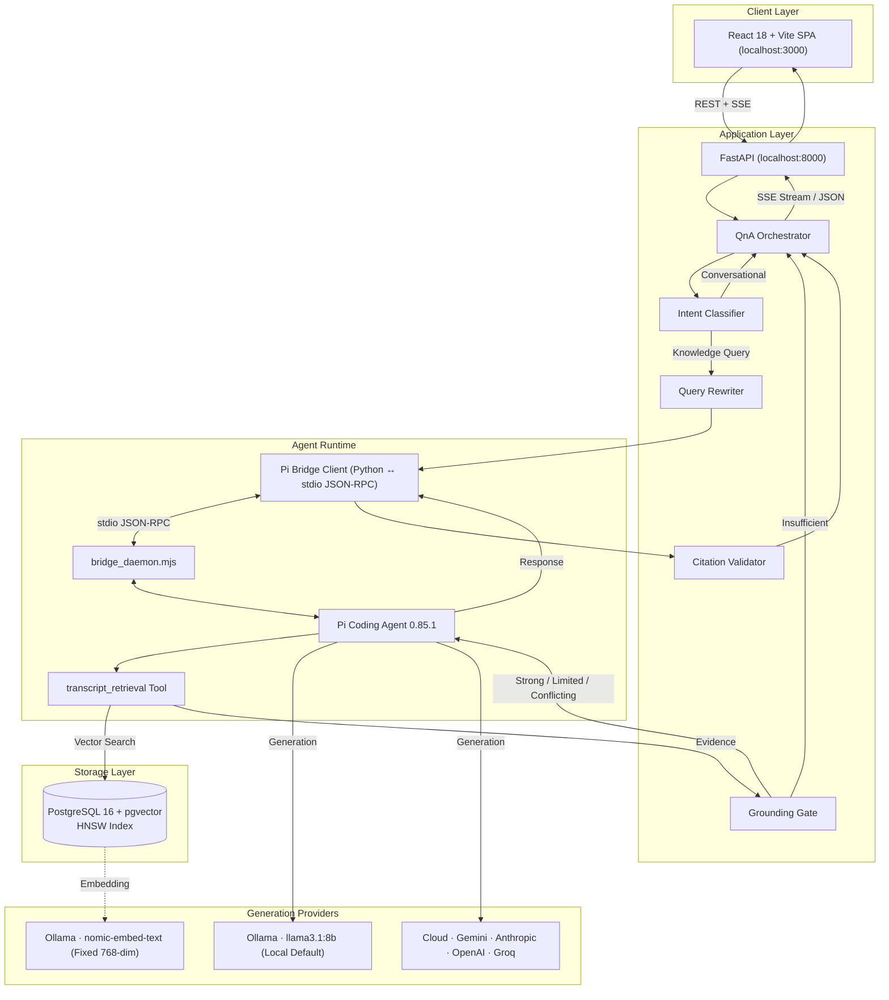

# The Lenny Growth Assistant

The Lenny Growth Assistant is an internal product and growth research assistant over a curated corpus of Lenny's Podcast transcripts. It provides source-grounded answers, follow-up research, and structured artifact generation without requiring users to understand retrieval, prompting, or model infrastructure.

This is not a generic chatbot. The transcript corpus is the sole source of truth. Every claim is validated against retrieved evidence with guest and episode citations. A deterministic grounding gate evaluates evidence strength before synthesis and refuses unsupported queries rather than hallucinating.

**Repository:** [github.com/nishantkr0904/The_Lenny_Growth_Assistant](https://github.com/nishantkr0904/The_Lenny_Growth_Assistant)

---

## Why This Exists

Lenny's Podcast contains one of the richest publicly available collections of product and growth knowledge — hundreds of episodes featuring practitioners from companies like Airbnb, Slack, Figma, Stripe, and many others. The problem is access and synthesis:

- **Discovery is manual.** Finding which episode discussed a specific topic requires searching through hundreds of transcripts.
- **Synthesis is labor-intensive.** Extracting a coherent answer from conversational transcripts — and cross-referencing what multiple guests said — takes significant effort.
- **Reuse is fragile.** Sharing insights typically means copying quotes into a document, losing attribution, and hoping the paraphrase is faithful.

The Lenny Growth Assistant solves this by combining semantic retrieval, deterministic grounding, agentic synthesis, source citations, and artifact generation into a single research tool.

---

## What It Does

- **Grounded Q&A** over Lenny's Podcast transcripts with episode and guest citations
- **Semantic transcript retrieval** using pgvector cosine similarity search
- **Evidence classification** into Strong, Limited, Conflicting, and Insufficient tiers
- **Source citations and inspection** with quoted excerpts and episode provenance
- **Follow-up questions** with session context and conversational query rewriting
- **Conversational routing** for casual messages (greetings, thanks) without forcing corpus retrieval
- **Explicit insufficient-evidence refusal** — the assistant never falls back to general LLM knowledge
- **Pi Coding Agent orchestration** as the production agent/runtime layer
- **Local Ollama generation** with zero cloud dependencies or API keys required
- **Cloud LLM generation** via Google Gemini, Anthropic Claude, OpenAI, and Groq
- **Runtime provider switching** through the UI without restarting services
- **In-app cloud API key configuration** with live validation before activation
- **Provider failure handling** — generation failures are surfaced explicitly and never disguised as successful answers
- **Ship 30 for 30 artifact generation** grounded in retrieved transcript evidence
- **Markdown and HTML/CSS artifacts** with structured writing principles
- **Safe artifact viewer** with Preview and Source tabs, copy-to-clipboard, and file download/export
- **Session management** with creation, persistence, history, and deletion with relational cascade
- **Light/dark theme** persisted across browser reloads

---

## Architecture Overview



Pi Coding Agent is part of the actual production generation path — not a development tool. Every grounded answer flows through the Pi runtime, which executes the `transcript_retrieval` tool, evaluates evidence, and generates responses through the configured provider.

---

## Generation Provider Architecture

Generation provider switching changes only the synthesis engine. Retrieval and embeddings remain fixed.

```
Generation Provider (switchable at runtime)
├── Ollama · llama3.1:8b          (local, default, zero API keys)
├── Google Gemini · gemini-2.5-flash    (cloud)
├── Anthropic · claude-3-5-sonnet-20241022  (cloud)
├── OpenAI · gpt-4o               (cloud)
└── Groq · llama-3.3-70b-versatile     (cloud)

Embedding Provider (fixed, never changes)
└── Ollama · nomic-embed-text · 768 dimensions
```

**Key invariants:**
- Switching generation providers does not require re-ingesting or re-embedding the corpus.
- Corpus embeddings are always generated by `nomic-embed-text` via Ollama at 768 dimensions.
- Retrieval is always backed by PostgreSQL + pgvector with HNSW cosine similarity indexing.
- An unconfigured cloud provider cannot become active. Selecting one without a valid API key leaves the current provider unchanged.

---

## Provider Configuration

### Local Provider (Ollama)

Ollama runs as a Docker container alongside the application and requires no API key. It is the default provider and works immediately after `docker compose up`.

### Cloud Providers (UI Configuration)

Cloud providers are configured through the application UI at runtime — not by editing source code or restarting containers.

**Evaluator flow:**

1. Click the **provider badge** in the application header to open the provider selector.
2. Click a cloud provider (Gemini, Anthropic, OpenAI, or Groq).
3. If the provider's API key is not yet configured, the application keeps the current provider active and presents the API key configuration form.
4. Enter the provider API key and submit.
5. The application validates the key against the provider's live API endpoint.
6. **If validation succeeds:** the key is saved and the provider becomes active.
7. **If validation fails:** the current provider remains active, any previously valid key is preserved, and an error message is displayed.

**Where are runtime-configured keys stored?**

UI-configured provider API keys are stored in the backend container's runtime credential store (`/app/.secrets/` with `0600` file permissions). They are held in application memory and optionally persisted to the container filesystem. They are **not** written into `.env`.

This is distinct from `.env` configuration:
- **`.env`** = bootstrap/environment configuration loaded at container startup
- **UI-configured API key** = runtime provider credential managed by the application's Provider Manager

Subsequent sessions recognize previously configured providers without requiring the key to be entered again, as long as the backend container has not been recreated.

---

## Environment Variables

All environment variables are documented in [`.env.example`](.env.example). Copy it to `.env` before starting services.

| Variable | Default | Required | Description |
|:---|:---|:---|:---|
| `LLM_PROVIDER` | `ollama` | Yes | Active generation provider (`ollama`, `gemini`, `anthropic`, `openai`, `groq`) |
| `OLLAMA_BASE_URL` | `http://ollama:11434` | Yes | Internal Ollama service URL |
| `OLLAMA_MODEL` | `llama3.1:8b` | Yes | Local generation model |
| `OLLAMA_TIMEOUT_SECONDS` | `60.0` | No | Ollama request timeout |
| `EMBED_MODEL` | `nomic-embed-text` | Yes | Fixed corpus embedding model |
| `EMBED_DIMENSIONS` | `768` | Yes | Embedding vector dimensions |
| `DATABASE_URL` | `postgresql+asyncpg://...` | Yes | Internal PostgreSQL connection string |
| `HOST_PORT_POSTGRES` | `5432` | No | Host-side PostgreSQL port |
| `HOST_PORT_BACKEND` | `8000` | No | Host-side backend port |
| `HOST_PORT_FRONTEND` | `3000` | No | Host-side frontend port |
| `HOST_PORT_OLLAMA` | `11434` | No | Host-side Ollama port |
| `GEMINI_API_KEY` | *(empty)* | No | Google Gemini API key (or configure via UI) |
| `GEMINI_MODEL` | `gemini-2.5-flash` | No | Gemini generation model |
| `ANTHROPIC_API_KEY` | *(empty)* | No | Anthropic API key (or configure via UI) |
| `ANTHROPIC_MODEL` | `claude-3-5-sonnet-20241022` | No | Anthropic generation model |
| `OPENAI_API_KEY` | *(empty)* | No | OpenAI API key (or configure via UI) |
| `OPENAI_MODEL` | `gpt-4o` | No | OpenAI generation model |
| `GROQ_API_KEY` | *(empty)* | No | Groq API key (or configure via UI) |
| `GROQ_MODEL` | `llama-3.3-70b-versatile` | No | Groq generation model |
| `RETRIEVAL_TOP_K` | `15` | No | Maximum chunks retrieved per query |
| `GROUNDING_STRONG_THRESHOLD` | `0.78` | No | Cosine similarity threshold for Strong evidence |
| `GROUNDING_LIMITED_THRESHOLD` | `0.65` | No | Cosine similarity threshold for Limited evidence |
| `ENVIRONMENT` | `development` | No | Runtime environment |
| `LOG_LEVEL` | `INFO` | No | Logging verbosity |
| `CORS_ORIGINS` | `["http://localhost:3000"]` | No | Allowed CORS origins |

Cloud API keys are optional. The application works fully with Ollama alone and zero cloud credentials.

---

## Prerequisites

- **Git**
- **Docker Desktop** (macOS/Windows) or **Docker Engine + Docker Compose V2** (Linux)
- **~8 GB disk space** for Docker images, Ollama model weights, and the embedded corpus

The canonical setup runs entirely in Docker. No local Python, Node.js, or Ollama installation is required.

---

## Installation

```bash
# 1. Clone the repository
git clone https://github.com/nishantkr0904/The_Lenny_Growth_Assistant.git
cd The_Lenny_Growth_Assistant

# 2. Create environment configuration
cp .env.example .env

# 3. Start all services
docker compose up -d

# 4. Verify all containers are running
docker compose ps
```

Expected containers: `lenny_backend`, `lenny_frontend`, `lenny_postgres`, `lenny_ollama`.

```bash
# 5. Verify backend health
curl http://localhost:8000/health
```

Expected response:
```json
{"status": "ok", "database": "connected", "ollama": "reachable", "provider": "ollama", "version": "0.1.0"}
```

```bash
# 6. Ensure required Ollama models are available
docker compose exec ollama ollama list
```

The backend requires `llama3.1:8b` (generation) and `nomic-embed-text` (embeddings). If not present:

```bash
docker compose exec ollama ollama pull llama3.1:8b
docker compose exec ollama ollama pull nomic-embed-text
```

### Transcript Corpus

The transcript corpus from the [ChatPRD/lennys-podcast-transcripts](https://github.com/ChatPRD/lennys-podcast-transcripts) repository should be cloned into `data/transcripts/`:

```bash
git clone https://github.com/ChatPRD/lennys-podcast-transcripts.git data/transcripts
```

If the corpus has already been ingested into PostgreSQL (as in the submitted repository state), no re-ingestion is needed. To verify:

```bash
docker compose exec backend python -c "
import asyncio
from app.db.session import async_session_factory
from sqlalchemy import text
async def check():
    async with async_session_factory() as s:
        eps = (await s.execute(text('SELECT count(*) FROM episodes'))).scalar()
        cks = (await s.execute(text('SELECT count(*) FROM chunks'))).scalar()
        print(f'Episodes: {eps}, Chunks: {cks}')
asyncio.run(check())
"
```

To run or re-run ingestion:

```bash
docker compose exec backend python -m scripts.ingest
```

Ingestion flags:
- `--limit N` — ingest only the first N transcripts
- `--dry-run` — parse and chunk without database writes
- `--force` — re-embed existing chunks
- `--chunk-size 600` — target chunk size in tokens (default: 600)
- `--chunk-overlap 100` — sliding token overlap (default: 100)

---

## Running the Application

```bash
# Start all services
docker compose up -d

# Rebuild after code changes
docker compose up -d --build

# Check service status
docker compose ps

# View backend logs
docker compose logs -f backend

# Stop all services
docker compose down
```

| Service | URL |
|:---|:---|
| Frontend | http://localhost:3000 |
| Backend API | http://localhost:8000 |
| API Documentation | http://localhost:8000/docs |
| Health Endpoint | http://localhost:8000/health |

---

## Transcript Corpus & Ingestion

The ingestion pipeline transforms raw transcript Markdown files into searchable, embedded chunks:

```
Transcript files (Markdown with YAML frontmatter)
  → Frontmatter parsing (guest, title, topics)
  → Dialogue normalization
  → Speaker-aware semantic chunking (~600 tokens, ~100 token overlap)
  → nomic-embed-text embedding (768 dimensions)
  → PostgreSQL + pgvector (HNSW cosine index)
```

Current corpus state:
- **303 transcripts** ingested
- **12,014 chunks** created and embedded
- **768-dimensional** vectors indexed via HNSW (`m=16`, `ef_construction=64`, `vector_cosine_ops`)

Each chunk retains its source metadata: episode title, guest name, chunk position, and the original excerpt. This metadata flows through retrieval, grounding, synthesis, and citation without loss.

---

## Grounding & Trust Model

The Grounding Gate is a deterministic mathematical evaluator that classifies retrieved evidence before any model synthesis occurs. It is not a prompt — it is computed from cosine similarity scores.

### Evidence Tiers

| Tier | Condition | Behavior |
|:---|:---|:---|
| **Strong** | Top similarity score ≥ 0.78 | Full synthesis with citations |
| **Limited** | Top score ≥ 0.65 and < 0.78 | Qualified answer noting limited coverage |
| **Conflicting** | Multiple high-relevance chunks from ≥ 2 guests with oppositional lexical signals | Surfaces disagreement explicitly |
| **Insufficient** | Top score < 0.65 | Refuses to answer; explains corpus limitation |

### Evidence Status ≠ Generation Status

Evidence evaluation (retrieval) is separate from generation (model synthesis). The system ensures:

- **Strong evidence + successful generation** = grounded answer with citations
- **Strong evidence + failed generation** = explicit generation failure message (never a blank answer with a misleading "Strong Evidence" badge)
- **Insufficient evidence** = refusal regardless of generation capability

This distinction prevents scenarios where retrieval succeeds but the generation provider fails silently, which would present an empty answer card with a false confidence indicator.

---

## Pi Coding Agent

Pi Coding Agent (v0.85.1) is the production agent runtime — not a development tool. Every grounded answer flows through Pi.

```
FastAPI → QnA Orchestrator → Pi Bridge Client (Python)
  ↔ bridge_daemon.mjs (stdio JSON-RPC)
  ↔ Pi Coding Agent Runtime
  → transcript_retrieval tool (vector search + grounding evaluation)
  → generation provider (Ollama or cloud)
  → response streamed back through bridge → orchestrator → SSE to frontend
```

The Pi bridge manages:
- Agent session lifecycle
- Tool registration (`transcript_retrieval`)
- Model runtime configuration for each provider
- Token-by-token streaming via SSE
- Error capture and generation failure flagging

---

## Cloud Provider Setup

Each cloud provider follows the same evaluator workflow in the UI:

| Provider | Model | API Key Prefix | Validation Endpoint |
|:---|:---|:---|:---|
| Google Gemini | `gemini-2.5-flash` | `AI...` | `generativelanguage.googleapis.com` |
| Anthropic | `claude-3-5-sonnet-20241022` | `sk-ant-...` | `api.anthropic.com` |
| OpenAI | `gpt-4o` | `sk-...` | `api.openai.com` |
| Groq | `llama-3.3-70b-versatile` | `gsk_...` | `api.groq.com` |

**For each provider:**

1. Click the provider badge in the header → select the cloud provider.
2. Enter the API key in the configuration form.
3. The application validates the key against the provider's API.
4. Successful validation saves the key and activates the provider.
5. Failed validation preserves the current active provider unchanged.
6. Provider switching does not affect retrieval or embeddings.

**Groq model resolution:** If the configured Groq model (`llama-3.3-70b-versatile`) is not accessible on the account, the system dynamically resolves to an available Groq chat model while maintaining the reported model identifier for UI consistency.

---

## Artifacts

Artifacts are structured written deliverables generated from grounded transcript evidence.

**Workflow:**

1. Ask a grounded question and receive a cited answer.
2. Click **Create Artifact** in the answer action bar.
3. Select an artifact type (Ship 30 for 30 essay, Markdown summary, or HTML card).
4. The artifact is compiled from the retrieved evidence and displayed in the Artifact Viewer.

**Artifact Viewer features:**
- **Preview** tab: rendered Markdown or HTML output
- **Source** tab: raw source code
- **Copy**: copy source to clipboard
- **Download**: export as `.md` or `.html` file

**HTML security:** Generated HTML is treated as untrusted output. The Artifact Viewer enforces:
- Sandboxed `<iframe>` with bare `sandbox` attribute (no `allow-scripts`, no `allow-same-origin`)
- HTML sanitization via Bleach to strip `<script>`, inline event handlers (`onclick`, `onerror`), `javascript:` URIs, `<iframe>`, `<object>`, `<form>`, and `<input>` elements
- Content Security Policy (CSP) injection

---

## Sessions & Conversation

- **Session creation:** each research session is persisted in PostgreSQL with a unique ID, creation timestamp, and message history.
- **Follow-up questions:** the query rewriter resolves pronouns and references using bounded conversational context (e.g., "What else did she say about that?" after discussing a specific guest).
- **Session history:** returning to a session loads the full message history.
- **Session deletion:** deleting a session cascades to all associated messages, sources, and artifacts in PostgreSQL.
- **Conversational routing:** casual messages (greetings, thanks) are routed directly to the generation provider without corpus retrieval, citations, or refusal cards.

---

## Theme & UI

- **Light/dark mode** toggle in the header, persisted in browser `localStorage` across reloads.
- **Provider selector** badge in the header showing the active provider and model.
- **In-app API key configuration** for cloud providers with live validation feedback.
- **Evidence indicators** showing grounding tier (Strong, Limited, Conflicting, Insufficient) on every answer.
- **Citation badges** linking to a source drawer with verified quotes and episode provenance.

---

## Testing

### Backend Test Suite

```bash
docker compose exec -T backend pytest
```

**Latest verified result: 144 passed in 7.7s**

| Test Module | Tests | Coverage |
|:---|:---|:---|
| `test_agent_tool.py` | 5 | Pi tool registration, execution, schema |
| `test_artifacts.py` | 5 | Artifact compilation, Markdown/HTML rendering |
| `test_audit_matrix.py` | 8 | Grounding audit matrix, adversarial testing |
| `test_chunker.py` | 4 | Speaker-turn segmentation, token boundaries |
| `test_citation.py` | 6 | Citation extraction, source matching, provenance |
| `test_config.py` | 3 | Pydantic settings validation |
| `test_conversational_intent.py` | 5 | Greeting routing, knowledge dispatch |
| `test_embeddings.py` | 5 | Batch embedding, dimensionality enforcement |
| `test_gemini.py` | 8 | Gemini generate, stream, key validation, factory |
| `test_groq.py` | 14 | Groq generate, stream, key validation, fallback, error handling |
| `test_health.py` | 4 | Readiness probes, connectivity |
| `test_ingestion.py` | 4 | Pipeline execution, idempotency |
| `test_openai.py` | 8 | OpenAI generate, stream, key validation, factory |
| `test_parser.py` | 4 | Frontmatter extraction, metadata normalization |
| `test_pi_bridge.py` | 10 | Stdio JSON-RPC lifecycle, tool query preservation |
| `test_providers.py` | 7 | All 5 provider adapters, unconfigured rejection, live validation |
| `test_qna_api.py` | 5 | Q&A endpoints, empty query rejection, SSE headers |
| `test_retrieval.py` | 23 | HNSW cosine search, grounding tiers, acronym boost |
| `test_rewriter.py` | 5 | Pronoun resolution, multi-turn rewriting |
| `test_security_sanitization.py` | 6 | Script stripping, event handler removal, CSP |
| `test_sessions.py` | 5 | Session CRUD, isolation, cascade deletion |

### Frontend Test Suite

```bash
cd frontend && npm test -- --run
```

**Latest verified result: 23 passed in 1.3s**

Covers: provider badge rendering for all 5 providers, provider menu interactions, unconfigured provider key form behavior, dark mode toggle, evidence indicator rendering, refusal card display, generation failure card display, citation badge interactions, source drawer rendering, artifact viewer sandboxing and tab toggling, session list rendering, session deletion, and session selection.

### Frontend Production Build

```bash
cd frontend && npm run build
```

TypeScript compilation (`tsc`) and Vite production build — verified passing with zero errors.

---

## Troubleshooting

### Docker services not starting

```bash
docker compose ps          # Check container status
docker compose logs backend   # Inspect backend logs
docker compose logs postgres  # Inspect database logs
```

### Backend health failure

```bash
curl http://localhost:8000/health
```

Common causes:
- **PostgreSQL unavailable:** check `lenny_postgres` container status and logs.
- **Ollama unavailable:** check `lenny_ollama` container status; ensure models are pulled.
- **Configuration issue:** verify `.env` exists and contains valid `DATABASE_URL`.

### Ollama model unavailable

```bash
docker compose exec ollama ollama list
```

If `llama3.1:8b` or `nomic-embed-text` are missing:

```bash
docker compose exec ollama ollama pull llama3.1:8b
docker compose exec ollama ollama pull nomic-embed-text
```

### Cloud provider API key not configured

1. Click the provider badge in the header.
2. Select the desired cloud provider.
3. Enter the API key in the configuration form.
4. Validation must succeed before the provider activates.
5. If validation fails, the previous provider remains active.

### Cloud provider generation failure

1. Check backend logs: `docker compose logs -f backend`
2. Verify the provider is correctly configured: `curl http://localhost:8000/api/v1/providers`
3. Retry the query or switch to a different provider.
4. Retrieval evidence may still be valid even when generation fails — the system will indicate this explicitly.

### Port conflict

Default host ports (configurable in `.env`):
- Frontend: `3000`
- Backend: `8000`
- PostgreSQL: `5432`
- Ollama: `11434`

Override with `HOST_PORT_FRONTEND`, `HOST_PORT_BACKEND`, `HOST_PORT_POSTGRES`, `HOST_PORT_OLLAMA` in `.env`.

### Frontend changes not visible after code edits

```bash
docker compose up -d --build frontend
```

---

## Security

- **No hardcoded secrets:** API keys are loaded from environment variables or runtime configuration. `.env` is excluded from version control via `.gitignore`.
- **Runtime credential isolation:** UI-configured provider keys are stored in the backend container's `/app/.secrets/` directory with `0600` permissions, never exposed back to the frontend or logs.
- **Untrusted output sandboxing:** Generated HTML artifacts are rendered in sandboxed iframes with no script execution, no same-origin access, and pre-render sanitization via Bleach.
- **No silent cloud fallback:** An unconfigured or invalid cloud provider never becomes active. Provider switching requires explicit successful key validation.
- **Explicit failure states:** Generation failures are surfaced as user-visible error messages, never hidden behind misleading success indicators.
- **Session isolation:** Sessions are isolated by ID in PostgreSQL; messages from one session do not leak into another.

---

## Project Documentation

| Document | Purpose |
|:---|:---|
| [`PRD.md`](PRD.md) | Product requirements, acceptance criteria, scope decisions, and risk analysis |
| [`architecture.md`](architecture.md) | System architecture, technical decisions, component design, and data flow |
| [`design.md`](design.md) | UX design, interaction patterns, and visual specifications |

---

## Repository Structure

```
The_Lenny_Growth_Assistant/
├── backend/
│   ├── app/
│   │   ├── agent/           # Pi bridge, orchestrator, intent, citation, retrieval tool
│   │   ├── api/v1/          # FastAPI routes (health, sessions, retrieval, providers, artifacts, ingest)
│   │   ├── artifacts/       # Artifact compiler, models, store
│   │   ├── core/            # Configuration, logging
│   │   ├── db/              # Database session, schema initialization
│   │   ├── ingestion/       # Transcript parsing, chunking, embedding pipeline
│   │   ├── providers/       # Ollama, Gemini, Anthropic, OpenAI, Groq adapters + manager
│   │   ├── retrieval/       # Search engine, grounding gate, query rewriter, models
│   │   └── sessions/        # Session models and persistence store
│   ├── scripts/             # Ingestion CLI (ingest.py)
│   ├── tests/               # 21 test modules (144 tests)
│   ├── Dockerfile
│   └── pyproject.toml
├── frontend/
│   ├── src/
│   │   ├── components/      # chat/, layout/, artifacts/, sessions/
│   │   ├── services/        # API client
│   │   ├── tests/           # Component tests (23 tests)
│   │   └── types/           # TypeScript type definitions
│   ├── Dockerfile
│   └── package.json
├── data/
│   └── transcripts/         # Cloned transcript corpus (git-ignored)
├── docker-compose.yml
├── .env.example
├── PRD.md
├── architecture.md
├── design.md
└── README.md
```

---

## Current Validation

Latest verified results from the checked-in implementation:

| Check | Result |
|:---|:---|
| Backend test suite (`pytest`) | 144 passed, 0 failed |
| Frontend test suite (`vitest`) | 23 passed, 0 failed |
| Frontend production build (`tsc && vite build`) | Passing, 0 errors |
| Ollama grounded E2E | Strong Evidence, 3 sources, complete answer with citations |
| Groq grounded E2E | Strong Evidence, 3 sources, complete answer in ~9s |
| Groq SSE streaming | Token-by-token streaming, ~2.6s latency |
| Groq conversational routing | Natural greeting response, no retrieval |
| Out-of-domain refusal | Insufficient tier, strict refusal, zero hallucination |
| Provider switching (Ollama ↔ Groq) | Seamless, no restart required |
| `git diff --check` | 0 whitespace/newline warnings |

---

## Evaluator Quick Start

1. **Start the application:**
   ```bash
   cp .env.example .env
   docker compose up -d
   ```

2. **Open the frontend:** Navigate to http://localhost:3000

3. **Ask a grounded question** using Ollama (works immediately, no API key needed):
   > "What is Shreyas Doshi's LNO framework?"

4. **Inspect the answer:** observe the evidence tier badge, source citations, and quoted excerpts in the source drawer.

5. **Ask a follow-up question:**
   > "How does that compare to what other guests said about prioritization?"

6. **Generate an artifact:** Click **Create Artifact** → select **Ship 30 for 30** → inspect the rendered essay in the Artifact Viewer.

7. **Test out-of-domain refusal:**
   > "What is quantum chromodynamics?"
   
   The assistant should refuse with an Insufficient evidence indicator.

8. **Try a cloud provider** (optional): Click the provider badge → select a cloud provider → enter your API key → the application validates and activates it.

9. **Try a conversational message:**
   > "Hi"
   
   The assistant responds naturally without forcing corpus retrieval.

No source code modifications are required for any of these steps.
