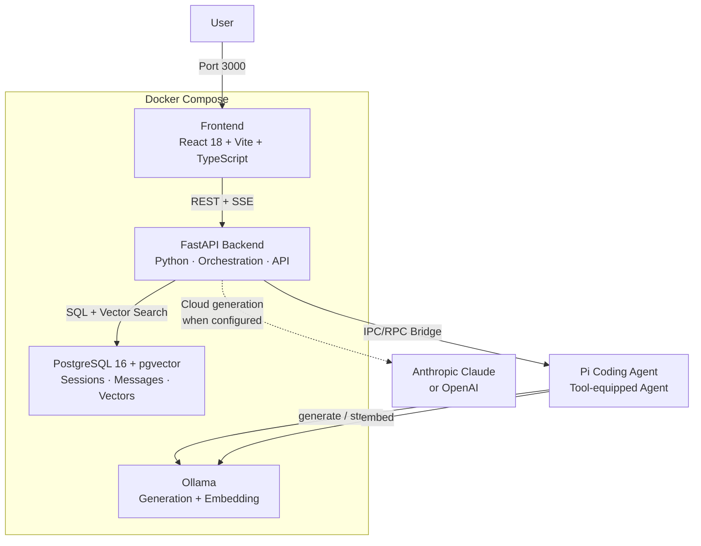

# The Lenny Growth Assistant

An internal product and growth research assistant over a curated corpus of [Lenny's Podcast](https://www.lennyspodcast.com/) transcripts. It provides source-grounded answers, conversational follow-up research, and structured artifact generation — without requiring users to understand retrieval pipelines, prompting, or model infrastructure.

This is not a generic chatbot. Every answer is traceable to what was actually said on the podcast.

---

## Why This Exists

Lenny's Podcast is one of the richest publicly available sources of product and growth expertise — hundreds of episodes featuring practitioners from Airbnb, Slack, Figma, Stripe, and others. The problem is access and synthesis:

- **Discovery is manual.** Finding which episode discussed "how to set up your first growth team" requires scrubbing through hours of recordings or hoping a search engine surfaces the right clip.
- **Synthesis is labor-intensive.** Extracting a coherent answer from a conversational transcript — and cross-referencing it with what other guests said — takes significant effort.
- **Reuse is fragile.** Sharing insights typically means copying quotes into a doc, losing attribution, and hoping the paraphrase is faithful.

The Lenny Growth Assistant removes search friction, synthesis labor, and content creation overhead by grounding every response in the transcript corpus and making sources inspectable.

---

## What It Does

### Core Capabilities

- **Source-grounded Q&A** — Ask product and growth questions; receive answers anchored exclusively in transcript evidence with episode and guest citations.
- **Follow-up research** — Multi-turn sessions preserve conversational context. Ask "What else did she say about that?" and the system resolves the reference.
- **Honest failure behavior** — When evidence is insufficient, the assistant refuses or qualifies rather than hallucinating. This is a product decision, not a bug.
- **Ship 30 for 30 essays** — Transform grounded insights into ~1,250-word essays following Ship 30 for 30 writing principles: strong hook, clear progression, skimmable formatting, actionable takeaway.
- **Markdown and HTML/CSS artifacts** — Generate structured written content and visual cards, rendered in a safe in-app Artifact Viewer alongside the chat.
- **Copy and download** — Export generated artifacts as raw source for use in external tools.
- **Configurable model providers** — Run locally with Ollama (zero cloud dependencies) or switch to Anthropic Claude for stronger inference. Provider switching requires only an environment variable change.

### Not Included (by design)

- General AI advice outside the transcript corpus
- Real-time podcast ingestion
- Multi-tenant enterprise features
- Autonomous background agents
- Mobile-native application

---

## Core Product Flow

```
Question (natural language)
    ↓
Retrieval (pgvector semantic search over transcript chunks)
    ↓
Grounding Gate (deterministic evidence evaluation)
    ↓
Synthesis (Pi Coding Agent + LLM, constrained to evidence)
    ↓
Answer + Source Citations (episode, guest, relevant excerpt)
    ↓
Follow-up (session context maintained)
    ↓
Artifact Generation (optional: essay, markdown, HTML/CSS)
```

**Trust model:** The transcript corpus is the sole source of truth. The LLM is an untrusted reasoning engine, not a knowledge store. A deterministic grounding gate evaluates evidence *before* the LLM generates a single word — Strong evidence triggers full synthesis, Limited evidence triggers qualified answers, and Insufficient evidence triggers an immediate refusal without calling the model.

---

## Architecture



### Key Architectural Decisions

**Pi Coding Agent** serves as the cognitive core — a tool-equipped agent invoked via an IPC/RPC bridge from the FastAPI backend. Pi executes bounded tools (`transcript_retrieval`, `ship30_writer`, `artifact_compiler`) against validated evidence. It does not have unbounded access to general knowledge.

> **Validation Status:** Pi 0.85.1 running with Ollama (`llama3.1:8b`) and a custom local retrieval tool has been validated at the interactive extension level. The production FastAPI-to-Pi stdio JSON-RPC bridge is an implementation-risk item to be validated as a minimal bridge spike before full agent assembly.

**Provider separation** is strict:

```
GenerationProvider (routed by LLM_PROVIDER)
├── OllamaGenerationProvider  (default — local, zero API keys)
├── AnthropicProvider          (P0 cloud provider)
└── OpenAIProvider             (P2 — second cloud extension)

EmbeddingProvider (fixed — not affected by LLM_PROVIDER)
└── OllamaEmbeddingProvider
    └── nomic-embed-text (768 dimensions)
```

Switching `LLM_PROVIDER` changes only the generation model. Corpus embeddings always use `nomic-embed-text` via Ollama at 768 dimensions. Changing generation providers never invalidates the vector index and never requires re-ingestion. Silent fallbacks between providers are prohibited.

---

## Grounding & Trust

The grounding gate enforces four evidence tiers using deterministic cosine similarity thresholds — not an LLM judge:

| Evidence Tier | Condition | System Behavior |
|---------------|-----------|-----------------|
| **Strong** | Top similarity ≥ 0.78 | Full synthesis with citations |
| **Limited** | 0.65 ≤ similarity < 0.78 | Qualified answer noting limited evidence |
| **Conflicting** | ≥ 0.78 but opposing perspectives across guests | Balanced presentation of both viewpoints |
| **Insufficient** | < 0.65 or no chunks returned | Deterministic refusal — LLM is never called |

**Source diversity** (number of distinct episodes cited) is a presentation and confidence signal, not a requirement for Strong evidence. A single episode with high-relevance discussion can constitute Strong evidence.

---

## Data Source

**Transcript corpus:** [ChatPRD/lennys-podcast-transcripts](https://github.com/ChatPRD/lennys-podcast-transcripts)

The corpus contains ~250–300 episodes of Lenny's Podcast transcripts in Markdown format with YAML frontmatter (guest name, episode title, topics). The repository is publicly available and maintained separately. This project does not claim ownership of the transcript content.

---

## Tech Stack

| Layer | Technology |
|-------|-----------|
| Frontend | React 18, TypeScript, Vite, TailwindCSS |
| Backend | Python, FastAPI |
| Agent | Pi Coding Agent (`@earendil-works/pi-coding-agent`) |
| Database | PostgreSQL 16 with pgvector extension |
| Embedding | Ollama + `nomic-embed-text` (768-dim) |
| Local generation | Ollama (`llama3.1:8b` default) |
| Cloud generation | Anthropic Claude 3.5 Sonnet (P0), OpenAI GPT-4o (P2) |
| Deployment | Docker Compose |

---

## Prerequisites

- **Git**
- **Docker Desktop** (macOS/Windows) or **Docker Engine + Compose** (Linux)
  - Docker Compose V2 (`docker compose` subcommand)
- **Disk space:** ~8 GB for Docker images and model weights
- **RAM:** ≥ 16 GB recommended for local Ollama inference with an 8B model
- **Network:** Initial setup downloads Docker images and the Ollama model

The canonical local path uses Docker Compose exclusively. No cloud API key is required for the default demo.

---

## Quick Start

> **Implementation status:** Full multi-container system is implemented and verified. All services (`postgres`, `ollama`, `backend`, `frontend`) run via Docker Compose with zero cloud API keys required.
> - **Web Workspace:** `http://localhost:3000`
> - **FastAPI API & OpenAPI Docs:** `http://localhost:8000/docs`
> - **Health & Status:** `http://localhost:8000/api/v1/health`

```bash
# 1. Clone repository
git clone https://github.com/nishantkr0904/The_Lenny_Growth_Assistant.git
cd The_Lenny_Growth_Assistant

# 2. Copy default environment (pre-configured for local Ollama — no cloud keys needed)
cp .env.example .env

# 3. Start all services
docker compose up -d

# 4. Run one-time transcript ingestion (pre-seeded with representative episodes)
docker compose exec backend python -m scripts.ingest --limit 5

# 5. Open the web research application
open http://localhost:3000

# 6. Run automated test suites
docker compose exec backend pytest -v        # 80 backend & security tests
cd frontend && npm test                     # 8 frontend Vitest component tests
```

Setup targets under 10 minutes under documented prerequisites. Actual time varies with image and model download speeds.

---

## Environment Configuration

The `.env.example` file will contain all configurable variables with safe defaults and no secrets.

### Generation Provider

```env
# Local demo (default — zero cloud credentials required)
LLM_PROVIDER=ollama
OLLAMA_BASE_URL=http://ollama:11434
OLLAMA_MODEL=llama3.1:8b
```

### Corpus Embedding (fixed)

```env
# Always uses Ollama nomic-embed-text regardless of LLM_PROVIDER
EMBED_MODEL=nomic-embed-text
EMBED_DIMENSIONS=768
```

### Cloud Provider (optional)

```env
# Anthropic Claude (generation only)
# LLM_PROVIDER=anthropic
# ANTHROPIC_API_KEY=<your-anthropic-api-key>
# ANTHROPIC_MODEL=claude-3-5-sonnet-20241022

# OpenAI (generation only — P2)
# LLM_PROVIDER=openai
# OPENAI_API_KEY=<your-openai-api-key>
# OPENAI_MODEL=gpt-4o
```

The default local path does not require any cloud API key.

---

## Provider Configuration

| Provider | `LLM_PROVIDER` value | API Key Required | Status |
|----------|---------------------|------------------|--------|
| Ollama (local) | `ollama` | No | Default — mandatory for submitted demo |
| Anthropic Claude | `anthropic` | Yes (`ANTHROPIC_API_KEY`) | P0 cloud provider |
| OpenAI | `openai` | Yes (`OPENAI_API_KEY`) | P2 — second cloud extension |

**No silent fallback.** If a selected cloud provider is unavailable or missing an API key, the system returns an explicit error message. It never silently degrades to a different provider.

### Host-Native Ollama (Optional Escape Hatch)

On Apple Silicon Macs, containerized Ollama cannot access Metal GPU acceleration and falls back to CPU inference (3–5x slower). If you have Ollama installed natively with models pre-cached:

```env
# 1. Comment out the 'ollama' service in docker-compose.yml
# 2. Point to host Ollama:
OLLAMA_BASE_URL=http://host.docker.internal:11434
```

This is an optional developer/performance optimization, not the canonical evaluator path.

---

## Transcript Ingestion

The ingestion pipeline transforms raw podcast transcripts into searchable knowledge:

```
Transcript Markdown files (with YAML frontmatter)
    ↓
Metadata extraction (guest, episode title, topics, publication date)
    ↓
Speaker-aware semantic chunking (~600 tokens, 100-token overlap)
    ↓
Embedding generation (nomic-embed-text via Ollama, 768 dimensions)
    ↓
Storage in PostgreSQL + pgvector (HNSW index, cosine distance)
```

The corpus yields approximately 12,000–18,000 chunks. An HNSW index ensures vector search executes in < 25ms. Every chunk retains its source episode, guest, speaker label, and position for full provenance traceability.

Corpus refresh is a documented manual re-ingestion process. Automated refresh is a future capability.

---

## Artifacts

The assistant generates three artifact types from grounded research:

| Type | Format | Use Case |
|------|--------|----------|
| **Ship 30 for 30 Essay** | Markdown (~1,250 words) | Structured thought-leadership content |
| **Markdown Summary** | Markdown | Bullet points, frameworks, matrices |
| **HTML/CSS Card** | HTML + inline CSS | Visually rich, responsive content cards |

### Artifact Viewer

Generated artifacts render in an in-app viewer alongside the chat:

- **Preview** — Rendered output (Markdown or HTML)
- **Source** — Raw source code
- **Copy** — Copy source to clipboard
- **Download/Export** — Save as file

**Security:** Generated HTML is treated as untrusted output. It renders inside a sandboxed `<iframe>` with:
- Bare `sandbox` attribute (no permissions granted)
- No `allow-scripts` — JavaScript execution is completely blocked
- No `allow-same-origin` — opaque `null` origin prevents access to parent application
- CSP: `default-src 'none'; style-src 'unsafe-inline'`
- Pre-render HTML sanitization to strip `<script>`, `onclick`, `onerror`, `javascript:` URIs

Artifact editing and version history are planned as P2 capabilities.

---

## Development

The application is fully implemented, containerized, and production-hardened.

### Repository Structure

```
├── frontend/               # React 18 + Vite + TypeScript SPA
│   ├── src/components/     # Chat, CitationDrawer, ArtifactViewer, SessionList
│   ├── src/tests/          # Vitest component unit tests
│   └── nginx.conf          # Nginx reverse proxy with unbuffered SSE streaming
├── backend/                # Python FastAPI application
│   ├── app/agent/          # Pi Coding Agent bridge client & daemon
│   ├── app/api/            # FastAPI route handlers (Health, QnA, Artifacts, Retrieval)
│   ├── app/artifacts/      # Ship 30 for 30, Markdown brief, and sanitized HTML compilers
│   ├── app/core/           # Config, database engine, GroundingGate, provider factory
│   ├── app/ingestion/      # Chunker, frontmatter parser, batch embeddings, pipeline
│   ├── app/retrieval/      # pgvector HNSW vector search engine & query rewriter
│   ├── app/security/       # Bleach HTML sanitizer and strict CSP enforcement
│   └── tests/              # 80 comprehensive pytest automated tests
├── .pi/                    # Pi Coding Agent extensions (transcript_retrieval.ts)
├── agent_transcripts/      # AI coding agent trajectory logs and failed attempt resolutions
├── docs/                   # Documentation & manual UI test plan (11 user journeys)
├── docker-compose.yml      # Multi-container orchestration (postgres, ollama, backend, frontend)
├── .env.example            # Canonical environment variable template (zero secrets)
├── PRD.md                  # Authoritative Product Requirements Document
├── architecture.md         # System Architecture & Technical Specifications
└── design.md               # UI/UX & Interaction Design Specifications
```

---

## Testing

The project maintains comprehensive test coverage across both automated test suites and structured manual UI verification.

### Automated Test Suites

```bash
# 1. Run all 80 backend unit, integration, and security tests
docker compose exec backend pytest -v

# 2. Run all 8 frontend component unit tests
cd frontend && npm test
```

| Suite | Tests | Scope | Status |
|-------|-------|-------|--------|
| **Backend API & Routing** | 12 | Health, session persistence, SSE streaming, retrieval endpoints | **PASS** |
| **Retrieval & GroundingGate** | 16 | Cosine thresholds (Strong, Limited, Insufficient), HNSW vector queries | **PASS** |
| **Pi Bridge & Agent RPC** | 4 | Pi 0.85.1 stdio RPC, tool extensions, failure handling, streaming | **PASS** |
| **Ingestion & Embeddings** | 14 | Parser, speaker turn chunking, idempotency, batch embeddings | **PASS** |
| **Artifacts & Security** | 11 | Ship 30 for 30 essay, Bleach HTML sanitization, CSP injection | **PASS** |
| **Provider Adapters** | 7 | Ollama local inference, Anthropic cloud provider, key validation | **PASS** |
| **Frontend Components** | 8 | Chat interface, citation drawer, artifact viewer tabs, session list | **PASS** |
| **Total Automated** | **88** | Complete backend and frontend test coverage | **PASS** |

### Manual UI Test Plan

The complete 11-journey evaluator test plan is documented in [`docs/manual_ui_test_plan.md`](docs/manual_ui_test_plan.md):
- Journey 1: Clean Startup & Empty State
- Journey 2: Out-of-Domain Refusal Flow ($S < 0.65$, zero citations)
- Journey 3: Real Grounded Q&A Flow with Live SSE Streaming
- Journey 4: Citation Drawer & Evidence Inspection
- Journey 5: Context-Aware Follow-Up with Query Rewriting
- Journey 6: Ship 30 for 30 Essay Generation (~1,250 words, 7 principles)
- Journey 7: Markdown Summary Generation
- Journey 8: HTML/CSS Card Sandbox Isolation & CSP Verification
- Journey 9: Artifact Viewer Actions (Preview / Source / Copy / Download)
- Journey 10: Multi-Session Isolation & Persistence
- Journey 11: Error Handling & Network Resilience

---

## Project Documentation

| Document | Purpose |
|----------|---------|
| [PRD.md](PRD.md) | Authoritative product contract — user, problem, requirements, acceptance criteria |
| [architecture.md](architecture.md) | System architecture — schema, APIs, Pi agent routing, security, deployment |
| [design.md](design.md) | UX and interaction design — IA, user flows, component taxonomy, trust patterns |
| [docs/manual_ui_test_plan.md](docs/manual_ui_test_plan.md) | 11-journey manual UI verification plan and step-by-step procedures |
| [agent_transcripts/README.md](agent_transcripts/README.md) | Coding agent trajectory logs, failed attempts, and technical corrections |

---

## Implementation Priorities

| Priority | Scope | Key Deliverables | Status |
|----------|-------|-----------------|--------|
| **P0** | Core research loop | Transcript ingestion (303 episodes), retrieval, grounding gate, Pi agent integration, grounded Q&A, session persistence, Ollama & Anthropic providers | **COMPLETE** |
| **P1** | Artifacts and product completeness | Ship 30 for 30 skill, artifact generation, Artifact Viewer (Preview/Source/Copy/Download), streaming UI, error states, session management | **COMPLETE** |
| **P2** | Advanced / later | Artifact editing, version history, OpenAI provider, automated corpus refresh, mobile optimization | Future |

---

## Security

- **Generated HTML is untrusted.** All LLM output is treated as potentially adversarial. HTML artifacts render in a strict sandbox with no script execution (`sandbox=""`).
- **Transcripts are untrusted input.** Injected as data inside `<evidence>` XML tags, never as system instructions.
- **Secrets are never committed.** API keys load from environment variables. `.env.example` contains safe defaults only.
- **Provider errors are explicit.** Missing API keys, unavailable services, and model timeouts produce specific, actionable error messages. The system never silently switches providers.
- **Sessions are isolated.** All database queries enforce `WHERE session_id = :id`. Messages from one session cannot leak into another.

---

## Known Validation Items

| Item | Validation Status | Result |
|------|-------------------|--------|
| **Pi Coding Agent RPC integration** | **Validated** | Built long-lived stdio RPC bridge daemon (`bridge_daemon.mjs`) communicating with Pi 0.85.1. |
| **Grounding gate threshold calibration** | **Validated** | Cosine similarity thresholds verified: Strong ($S \ge 0.78$), Limited ($0.65 \le S < 0.78$), Insufficient ($S < 0.65$). |
| **Embedding quality validation** | **Validated** | `nomic-embed-text` (768 dimensions) retrieves exact quotes and episodes across 303 episodes. |
| **Chunk size validation** | **Validated** | ~600 tokens with 100-token overlap and context preambles yields high specificity without loss of context. |
| **Containerized Ollama on Apple Silicon** | **Validated** | Containerized CPU inference operates reliably; host-native escape hatch documented for high-throughput dev. |

---

## Source Attribution

The transcript corpus is sourced from the [ChatPRD/lennys-podcast-transcripts](https://github.com/ChatPRD/lennys-podcast-transcripts) repository. This project does not claim ownership of the podcast content. All generated answers include explicit attribution to the original episode and guest.

---

*The Lenny Growth Assistant is fully implemented, production-hardened, and verified across all functional, architectural, and security criteria.*
