# Design — The Lenny Growth Assistant

**Version:** 1.0
**Role:** Senior Product Designer / UX Architect
**Status:** Draft — Pending Team Review
**Last Updated:** 2026-09-13

**Source-of-Truth Order:**
1. [Forward Deployed Engineer Take-Home Assignment](file:///Users/nishant/Documents/Oogy-Labs/The_Lenny_Growth_Assistant/Forward_Deployed_Engineer_Take_Home_Assignment%20(1)%20(1).docx.md) — authoritative for assignment requirements
2. [PRD.md](file:///Users/nishant/Documents/Oogy-Labs/The_Lenny_Growth_Assistant/PRD.md) — authoritative for product decisions
3. [architecture.md](file:///Users/nishant/Documents/Oogy-Labs/The_Lenny_Growth_Assistant/architecture.md) — authoritative for technical boundaries
4. This document — UX judgment and interaction design

---

## 1. Design Philosophy

### The Product Is Not a Chatbot

The Lenny Growth Assistant is a **source-grounded product and growth research assistant**. Its value is not that it can generate fluent text — any LLM can do that. Its value is that every answer is traceable to what was actually said on Lenny's Podcast.

The interface must make this distinction intuitive at first glance. The user's mental model should be:

> "I am asking a research assistant to help me learn from what Lenny's Podcast guests actually said."

Not:

> "I am chatting with a generic AI that happens to know about Lenny."

### Trust Before Magic

The most important UX problem is not making the AI feel magical. It is making the user trust that the answer actually comes from the transcript corpus.

This means:
- **Source grounding is visible** without being visually noisy.
- **Limitations are honest** — the UI never encourages the model to fabricate.
- **Evidence quality is communicated** — strong evidence, limited evidence, conflicting perspectives, and insufficient evidence are visually distinct states, not hidden metadata.
- **Failures are specific** — "I couldn't find enough evidence" is fundamentally different from "something went wrong."

### Research Tool, Not Content Generator

The primary workflow is research → synthesis → optional transformation. Artifact generation is important but secondary. The interface should not position the product as "an AI writing tool" but as "a research assistant that can also format your findings."

### Calm Information Density

The visual tone should be professional, focused, and research-oriented. Information density should be high enough to be useful without becoming cluttered. The interface should feel like a tool for practitioners — not a consumer chatbot with gradients and glowing orbs.

---

## 2. Users and UX Jobs

### Primary User

**Role:** Product Manager, Growth Lead, or Founder at a product-led company
**Experience:** 2–10 years in product/growth
**Context:** Researching growth tactics, preparing a strategy discussion, or writing an internal brief
**Technical sophistication:** Can evaluate answer quality, but should not need to understand prompts, models, or retrieval pipelines
**Frequency:** 2–5 research sessions per week during active research phases

### UX Jobs to Be Done

| Job | What Success Looks Like | Design Implication |
|-----|------------------------|--------------------|
| **Find what experts said** about a product/growth topic | User gets a grounded answer in < 30 seconds with clear source attribution | Conversation-first layout; sources are visible without clicks |
| **Verify the source** of a claim | User can trace any claim back to episode, guest, and approximate quote | Citations are first-class UI, not afterthought footnotes |
| **Follow a research thread** across multiple turns | Follow-up questions feel natural; the assistant resolves context correctly | Conversation state is visually continuous; no need to restate context |
| **Understand when the assistant doesn't know** | Refusal is clear, honest, and distinguishable from an error | Distinct visual treatment for "insufficient evidence" vs "system error" |
| **Transform research into reusable content** | User produces a polished essay or formatted artifact from their research | Artifact generation is connected to the research, not a separate feature |
| **Trust the boundary** of the assistant's knowledge | User has a clear mental model of what the tool can and cannot answer | Corpus scope communicated on first screen; evidence quality visible |

---

## 3. UX Goals

1. **Time to trust:** A new user should understand what the product does and why they should trust it within 10 seconds of opening the application.
2. **Time to insight:** From question to useful, source-attributed answer in under 30 seconds (local) or under 15 seconds (cloud).
3. **Source verification effort:** A user should be able to answer "why did the assistant say this?" with one click.
4. **Research continuity:** Follow-up questions, source inspection, and artifact generation should feel like a continuous workflow, not a sequence of disconnected features.
5. **Honest boundaries:** The interface should never encourage the user to believe the assistant knows more than it does.

---

## 4. UX Principles

### Principle 1: Evidence Is Part of the Answer
Source citations are not metadata appended below the answer. They are part of the primary answer experience. The user reads the synthesis and can immediately see which guests and episodes support it.

### Principle 2: Failures Are Not Bugs
"I couldn't find enough evidence in the transcripts" is a successful product interaction — it means the grounding boundary held. The UI should treat knowledge limitations as a normal state, not an error.

### Principle 3: Progressive Disclosure Over Feature Walls
The primary screen should contain: ask a question, read the answer, verify sources, continue researching. Everything else — session history, artifact generation, provider status — should be accessible but not competing for primary attention.

### Principle 4: The User Controls the Agent
The assistant helps; the user decides. Artifact generation is user-initiated, not automatic. Content is reviewed before use. Answers can be questioned. The agent never takes irreversible actions without explicit user intent.

### Principle 5: Design for the Evaluator Demo
The interface should be immediately comprehensible. An evaluator should be able to understand the product's value, ask a question, verify a source, generate an artifact, and confirm the grounding boundary in a single 3-minute walkthrough without instructions.

---

## 5. Core User Journey

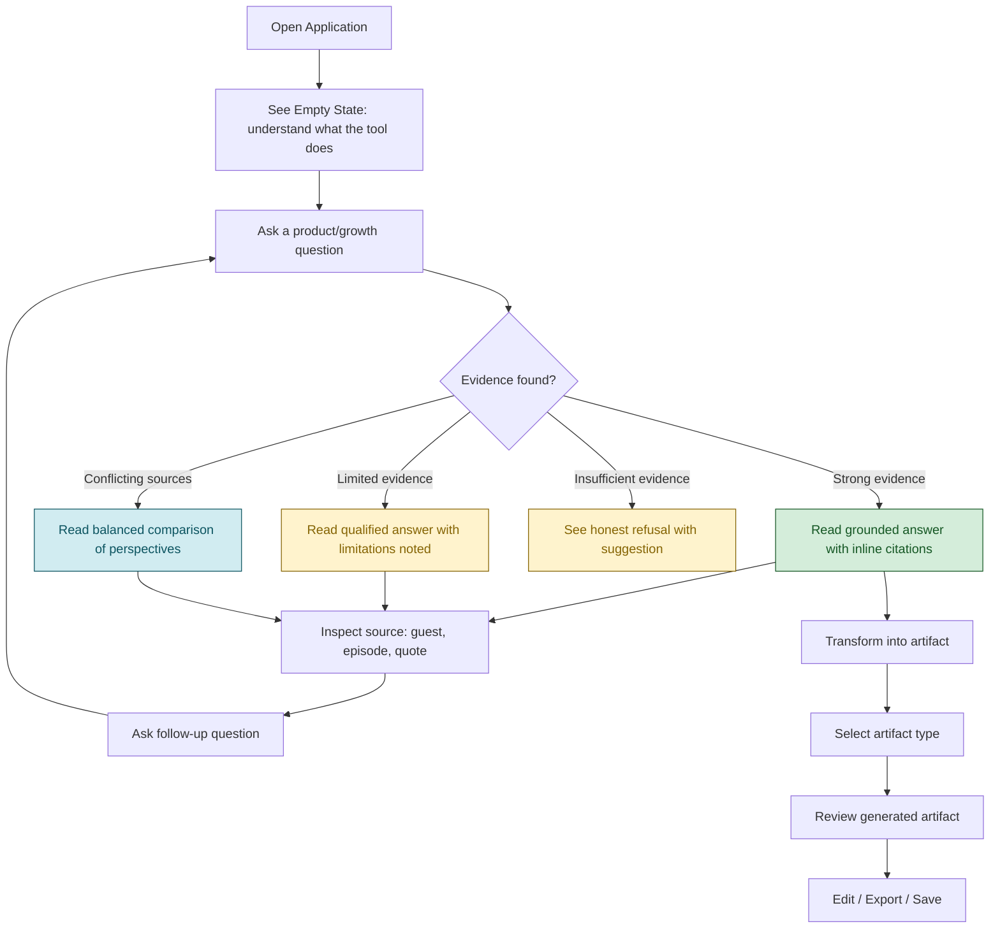

---

## 6. Information Architecture

```
The Lenny Growth Assistant
│
├── Conversation (Primary Surface)
│   ├── Chat Thread
│   │   ├── User Messages
│   │   ├── Assistant Responses
│   │   │   ├── Answer Synthesis
│   │   │   ├── Inline Source Badges
│   │   │   └── Evidence Quality Indicator
│   │   └── System Messages (errors, refusals)
│   ├── Composer (Input)
│   └── Loading / Progress States
│
├── Source Context (Contextual Surface)
│   ├── Source Drawer (slides in from right)
│   │   ├── Source Cards
│   │   │   ├── Guest Name
│   │   │   ├── Episode Title
│   │   │   ├── Publication Date
│   │   │   ├── Relevant Quote Excerpt
│   │   │   └── Episode Link
│   │   └── Source Navigation
│   └── Citation Popover (inline, on hover/click)
│
├── Session History (Secondary Surface)
│   ├── Session List (collapsible sidebar)
│   ├── Session Creation
│   └── Session Switching
│
├── Artifact Viewer (On-Demand Surface)
│   ├── Rendered Preview
│   │   ├── Markdown Renderer
│   │   └── Sandboxed HTML Viewer (iframe)
│   ├── Raw Source View
│   ├── Edit Mode
│   ├── Copy / Export Actions
│   └── Source Attribution Badge
│
└── System Status (Ambient Surface)
    ├── Provider Badge (Ollama / Anthropic / OpenAI [P2])
    └── Health Indicator
```

### Hierarchy Rationale

| Priority | Content | Location |
|----------|---------|----------|
| **Level 1** | What did the assistant conclude? | Answer text — largest, most prominent |
| **Level 2** | Why should I believe it? | Inline source badges + evidence indicator |
| **Level 3** | Where did it come from? | Source drawer with full episode context |
| **Level 4** | What can I do next? | Composer + artifact actions |

---

## 7. Application Shell

### Layout Decision

**Decision:** Two-column base layout with contextual right panel, not a permanent three-column workspace.

```
┌────────────────────────────────────────────────────────────────────────┐
│  ┌─ App Identity ─────────┐  ┌── Status ──┐  ┌─ Session Controls ─┐  │
│  │  🎙 Lenny Growth Asst  │  │ ollama:8b  │  │  + New Session      │  │
│  └────────────────────────┘  └────────────┘  └────────────────────┘  │
├────────┬───────────────────────────────────────┬─────────────────────┤
│        │                                       │                     │
│Session │          Conversation                 │   Source Drawer     │
│History │                                       │   (Contextual)      │
│        │  ┌─────────────────────────────────┐  │                     │
│ · PLG  │  │ User: What have guests said     │  │  ┌──────────────┐  │
│   team │  │ about product-led growth?       │  │  │ Source Card   │  │
│        │  └─────────────────────────────────┘  │  │ Elena Verna   │  │
│ · PMF  │                                       │  │ Ep: PLG Deep  │  │
│   strat│  ┌─────────────────────────────────┐  │  │ Date: 2023    │  │
│        │  │ 🟢 Based on 4 episodes:         │  │  │ "PLG is an   │  │
│ · Pric │  │                                 │  │  │  acquisition  │  │
│   ing  │  │ Answer with [1] [2] badges...   │  │  │  model..."   │  │
│        │  └─────────────────────────────────┘  │  └──────────────┘  │
│        │                                       │                     │
├────────┴───────────────────────────────────────┴─────────────────────┤
│  ┌────────────────────────────────────────────────────┐  ┌────────┐  │
│  │  Ask about product strategy, growth, or PMF...     │  │  Send  │  │
│  └────────────────────────────────────────────────────┘  └────────┘  │
└──────────────────────────────────────────────────────────────────────┘
```

**Why not a permanent three-column layout?** A persistent source panel consumes ~25% of screen width continuously, reducing the reading area for the primary conversation. For a research tool where the user reads long-form answers, horizontal space is valuable. The source drawer appears only when the user clicks a citation, preserving screen real estate while keeping sources one click away. (See Trade-off 1 in §25.)

**Session sidebar:** Collapsible. Defaults to collapsed on screens below 1440px to maximize conversation width. Always accessible via a hamburger icon or keyboard shortcut.

**Source drawer:** Slides in from the right when a citation is clicked. Dismisses when clicking outside, pressing Escape, or clicking a close control. Does not permanently occupy space.

**Artifact viewer:** When an artifact is generated, the right panel transforms into the Artifact Viewer (replacing the source drawer). A toggle allows switching between artifact view and source view.

---

## 8. Empty State

The first screen communicates what this product is and what the user can do.

### Content

**Heading:** "Research Lenny's Podcast"

**Subheading:** "Ask product and growth questions grounded in what Lenny's guests actually said. Every answer cites its sources."

**Corpus indicator:** "Backed by ~300 Lenny's Podcast episodes · ~15,000 indexed transcript passages"

**What to ask section:** A brief set of example prompts, presented as clickable cards, not a wall of text:

| Example Prompt | Category |
|---------------|----------|
| "What do the best growth teams look like according to Lenny's guests?" | Team structure |
| "How have successful PMs described product-market fit?" | Strategy |
| "Compare what Elena Verna and Casey Winters have said about PLG" | Guest comparison |
| "What advice have guests given about pricing strategy for early-stage products?" | Tactics |
| "When should a startup hire its first growth person?" | Hiring |

**Design notes:**
- Examples are phrased as questions, not factual claims. We do not imply that a specific guest said something unless the source corpus confirms it.
- Clicking an example card inserts it into the composer and does NOT auto-submit. The user retains control to edit or submit.
- The empty state subtly communicates the grounding boundary: "grounded in what Lenny's guests actually said" sets the expectation that this is not a generic AI.

**What not to include:**
- No "How can I help you today?" — this is not a generic assistant.
- No model configuration controls.
- No usage analytics or dashboards.
- No decorative AI imagery.

---

## 9. Conversation Experience

### Message Threading

Messages alternate between user and assistant in a single-threaded conversation. Each message occupies the full conversation width (minus padding). User messages are visually distinguished from assistant responses through alignment, background color, and typography — not just a name label.

### Follow-Up Continuity

The assistant resolves pronouns and references from prior turns (e.g., "What else did she say?" after discussing Elena Verna). This is handled at the query-rewriting stage in the architecture (§10.2), not by injecting the full conversation history into every prompt.

The UI should make follow-up questions feel natural:
- The composer retains focus after each response.
- No modal or confirmation interrupts the conversation flow.
- The scroll position follows the latest response.

### Conversational Context vs. Knowledge Retrieval

The interface should not imply that the conversation has "memory" equivalent to knowledge. Specifically:
- The assistant remembers what was said in this session (short-term context).
- The assistant does NOT accumulate knowledge across sessions.
- Each question triggers a fresh retrieval against the transcript corpus.

This distinction matters for user expectations: "You mentioned Elena Verna earlier" is session memory. "What do you know about PLG?" is a retrieval question.

### Query Composer

The composer is the primary interaction surface.

**Placeholder text:** "Ask about product strategy, growth, or what Lenny's guests recommend..."

**Behavior:**
- `Enter` submits the message (single-line).
- `Shift+Enter` inserts a newline (multi-line).
- `Cmd+Enter` / `Ctrl+Enter` always submits regardless of cursor position.
- Submit button is visible and clickable as an alternative.
- Empty input submission is prevented (button disabled, Enter is no-op).
- Very long input (> 2,000 characters): accepted but the composer expands up to a max-height before scrolling internally.
- During response streaming: composer is dimmed but not disabled. The user can prepare their next question.
- Cancellation: if streaming is in progress, a "Stop" button replaces the "Send" button, allowing the user to cancel the current generation.

---

## 10. Answer and Evidence Design

### Answer Structure

A strong default answer contains:

1. **Direct synthesis** — the answer to the question, presented in natural language.
2. **Key supporting points** — structured with headings or bullets when the answer is complex.
3. **Inline source badges** — compact citation markers adjacent to each claim (e.g., `[Elena Verna, Ep. 47]`).
4. **Evidence quality indicator** — a subtle visual signal communicating the grounding tier.

Not every answer should follow a rigid template. Simple factual questions ("When did Brian Chesky appear on the podcast?") should produce short, direct answers. Complex synthesis questions ("Compare approaches to PMF") should produce structured multi-point responses.

### Evidence Quality Indicators

The architecture's Grounding Gate produces four tiers. The UI must reflect each:

| Tier | Visual Treatment | User-Visible Signal |
|------|-----------------|---------------------|
| **Strong evidence** | Green/teal indicator dot: "Based on N episode(s)" | No special treatment needed — this is the default confident state |
| **Limited evidence** | Amber indicator dot: "Limited evidence" | Qualifying language in the answer + a badge noting partial coverage |
| **Conflicting evidence** | Blue indicator dot: "Multiple perspectives" | The answer explicitly presents both viewpoints with separate citations |
| **Insufficient evidence** | No dot (different message style entirely) | A distinct "refusal card" with suggestion text (see §10.1 below) |

### 10.1 Refusal UX (Insufficient Evidence)

When the Grounding Gate returns Tier 3 (insufficient evidence), the response is NOT styled as an assistant message with a sad face. It is styled as a **system boundary message** — visually distinct from both assistant answers and error messages.

**Visual treatment:**
- Muted background (light warm gray or soft amber).
- No artificial apology or hedging ("I'm so sorry, but...").
- Clear, factual language: "I couldn't find enough support in the Lenny's Podcast transcripts to answer this confidently."
- Optional suggestion: "You might try rephrasing, or asking about a related topic like [suggestion]."

**Why distinct from error:** An error means something broke. A refusal means the system worked correctly — it protected the user from a hallucinated answer. These are fundamentally different experiences.

---

## 11. Citation and Source Experience

### Inline Citations

Each substantive claim in an assistant response includes an inline citation badge:

```
[Elena Verna, Ep. 47]  [Casey Winters, Ep. 89]
```

**Badge design:**
- Compact pill shape with guest name and episode number.
- Visually subordinate to the answer text (smaller font, muted color).
- Clickable — opens the Source Drawer with the full source card.
- Hoverable — shows a tooltip popover with the relevant quote excerpt (desktop only).

**Why inline + drawer, not inline + full citation block?** Full citation blocks after every claim would make answers unreadable. Long footnote lists at the bottom lose the connection between claim and source. Inline badges maintain the connection while keeping the answer scannable. The drawer provides depth on demand. (See Trade-off 8 in §25.)

### Source Drawer

When a citation badge is clicked, the Source Drawer slides in from the right edge of the conversation pane. It contains one or more Source Cards.

### Source Card

Each Source Card displays:

| Field | Purpose |
|-------|---------|
| **Guest name** | Primary identifier — "Who said this?" |
| **Episode title** | Context — "In what conversation?" |
| **Publication date** | Recency — "How recent is this advice?" |
| **Relevant quote excerpt** | Verification — "What exactly was said?" |
| **Episode link** | Deep dive — links to show notes or YouTube |

**What the Source Card does NOT include:**
- Internal chunk IDs or database identifiers.
- Embedding vectors or similarity scores by default.
- Full transcript text (impractical; link to source instead).

### Citation Interaction

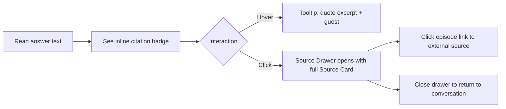

---

## 12. Session Management

### Session Sidebar

The left sidebar contains a chronological list of past sessions. Each session item shows:
- **Session title** — auto-generated from the first user message (truncated to ~40 characters). Editable via double-click or edit icon.
- **Timestamp** — relative time ("2 hours ago", "Yesterday").
- **Message count** — subtle indicator of session depth.

### Session Operations

| Action | Trigger | Behavior |
|--------|---------|----------|
| **New session** | "+" button in header or `Cmd+N` | Creates a fresh session, clears the conversation pane, focuses the composer |
| **Switch session** | Click session item in sidebar | Loads the selected session's message history; resets source drawer |
| **Rename session** | Double-click title or pencil icon | Inline text editing; saves on Enter or blur |
| **Delete session** | Right-click → Delete (or swipe on mobile) | Confirmation prompt; soft-deletes from database |

**Design decision: auto-generated titles over manual naming.** Users rarely name sessions proactively. Auto-generating a title from the first message reduces friction while remaining meaningful enough for later recognition. Users who want better names can edit. (See Trade-off 9 in §25.)

### Session State Persistence

Per architecture §10.1, sessions are persisted in PostgreSQL. A user can close the browser, restart the Docker stack, and return to their session with full message history intact. The UI should load prior sessions on application startup and display a brief loading skeleton during hydration.

---

## 13. Artifact Workflow

### Artifact Generation Flow

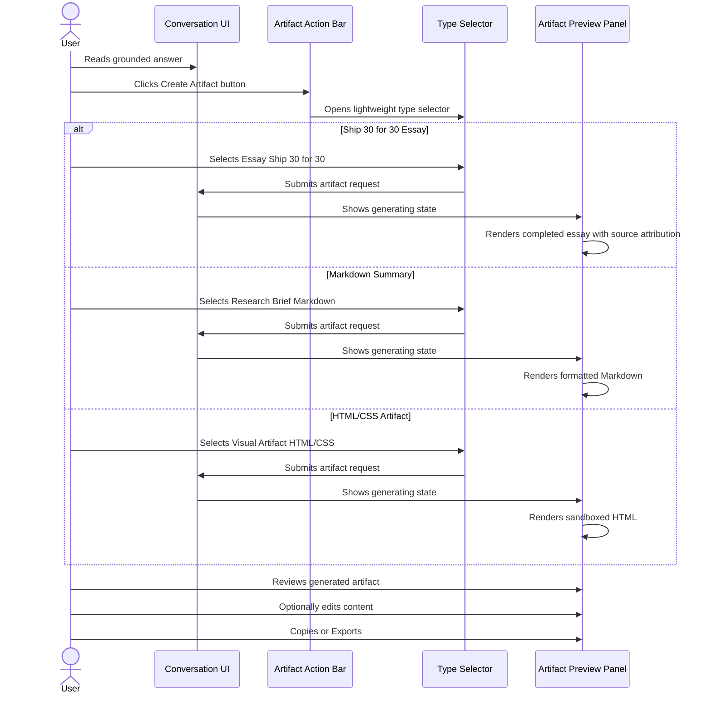

### Artifact Type Selection

Type selection uses user-facing descriptions, not technical labels:

| User-Facing Label | Internal Type | Description |
|-------------------|---------------|-------------|
| **Essay (Ship 30 for 30)** | `ship30_essay` | "~1,250-word essay using the Ship 30 for 30 format. Hook, narrative, takeaways — grounded in what Lenny's guests said." |
| **Research Brief (Markdown)** | `markdown` | "Structured notes with headings, bullets, and source citations. Ready to paste into a doc." |
| **Visual Artifact (HTML/CSS)** | `html_card` | "A styled, self-contained HTML card. Viewable in the artifact viewer." |

**Presentation:** Displayed as a compact dropdown or a small set of radio cards — not a multi-step wizard. The user selects a type and clicks "Generate." Configuration beyond type selection is intentionally minimal. (See Trade-off 7 in §25.)

### Artifact Source Traceability

Every generated artifact includes a "Sources" section or attribution badge listing the transcript evidence that informed it. This reinforces the core product principle: artifacts are transformations of research, not independent AI-generated content.

---

## 14. Artifact Viewer and Security UX

### Viewer Layout

When an artifact is generated, the right panel of the application transforms into the Artifact Viewer. The viewer operates in three modes, toggled via tabs:

| Mode | Behavior |
|------|----------|
| **Preview** | Rendered output — Markdown as formatted text, HTML in sandboxed iframe |
| **Source** | Raw Markdown or HTML source code with syntax highlighting |
| **Edit** *(P2)* | Editable text area with live preview (Markdown only; HTML editing is source-only). Editing is a P2 capability — not required for initial release. |

### Security Boundary UX

Per architecture §12, generated HTML is rendered inside a sandboxed `<iframe>` with bare `sandbox` attribute (no `allow-scripts`, no `allow-same-origin`). JavaScript execution is completely blocked. This aligns with PRD FR-36.

**Visual separation:** The artifact viewer includes a subtle but clear boundary between trusted application UI and generated content:
- A thin border or visual divider separates the viewer panel from the rest of the UI.
- A small "Generated content" label appears above the preview area.
- The artifact viewer background is slightly offset (e.g., a 1-2px inset or subtle shadow) to distinguish it from the application chrome.

**What the user should NOT see:**
- No scary "WARNING: UNTRUSTED CONTENT" banners. The security boundary should be technically strong but visually unobtrusive.
- No iframe attributes, CSP headers, or security configuration details.

**What happens when rendering fails:** If the HTML artifact fails to render in the iframe, the viewer falls back to the raw Markdown view with a badge: "HTML formatting issue — showing as text." This matches the architecture's failure behavior (§17.1).

### Export Actions

| Action | Behavior |
|--------|----------|
| **Copy to clipboard** | Copies raw Markdown or HTML source |
| **Download** | Downloads as `.md` or `.html` file |

---

## 15. Provider / Model UX

### Design Decision: Hide Complexity, Show Status

Provider configuration is an operational concern, not a user workflow. The primary user cares about answer quality and evidence, not which model generated the response.

However, the assignment requires that the active provider is visible (PRD FR-35), and the architecture explicitly prohibits silent fallback (architecture §9.3).

**Solution:** A compact provider badge in the application header that displays the active provider name.

**Provider badge states:**

| State | Display | Explanation |
|-------|---------|-------------|
| **Ollama active** | `🟢 Ollama (llama3.1:8b)` | Local model running |
| **Cloud active** | `🟢 Anthropic (Claude 3.5 Sonnet)` | Cloud provider active |
| **Provider error** | `🔴 Ollama — Unavailable` | Service unreachable; clickable for details |
| **Missing API key** | `🟡 Anthropic — No API Key` | Configuration issue; clickable for guidance |

**Why a badge, not a settings panel?** The provider badge answers the evaluator's question ("which model is running?") without adding a settings page that distracts from the research workflow. Provider switching is an environment-variable change, not a UI operation. (See Trade-off 2 in §25.)

### What the provider badge does NOT include:
- Model parameter controls (temperature, top-p, etc.)
- Token count or cost estimates
- Prompt templates
- API key entry fields (these belong in `.env`, not the UI)

---

## 16. Loading, Progress, and Error States

### Loading / Thinking States

The architecture's SSE stream emits structured events: `thinking`, `evidence`, `delta`, `citation`, `done`. The UI can use the `thinking` and `evidence` events to show meaningful progress.

**Recommended progression:**

| Event | User Sees | Visual |
|-------|-----------|--------|
| Request sent | "Searching transcripts..." | Subtle pulsing dot or animated text |
| `evidence` event received | "Found N relevant sources. Preparing answer..." | Text update; no fake animation |
| `delta` tokens streaming | Progressive text rendering | Text appears word-by-word in the answer area |
| `done` event | Complete answer with citation badges | Loading indicator disappears |

**Design rules for loading states:**
- Only show stages that correspond to actual system events. Do not invent intermediate stages.
- If SSE events are unreliable or too fast to display, fall back to a single honest state: "Thinking..." with a subtle animation.
- Never show a fake progress bar with percentages.
- Never expose chain-of-thought or internal reasoning.

### Error States

Errors are classified into two categories with distinct visual treatments:

**System Failures** (something broke):

| Error | User Message | Visual |
|-------|-------------|--------|
| Database unavailable | "Unable to connect to the database. Your message hasn't been saved. Please check the PostgreSQL service." | Red banner with retry button |
| Ollama unavailable | "The local model service isn't available. Please ensure Ollama is running or switch to a cloud provider." | Red banner with troubleshooting hint |
| Cloud provider error | "The cloud provider returned an error. Please try again in a moment." | Red banner with retry button |
| Missing API keys | "Cloud provider [X] is selected but no API key is configured. Add your key to `.env` or switch to Ollama." | Amber banner with configuration guidance |
| Timeout | "The model took too long to respond. This can happen with complex questions on local hardware." | Amber banner with retry button |
| Artifact generation failure | "The artifact couldn't be generated. Try regenerating or choosing a different format." | Amber banner in artifact panel |
| Artifact loading failure | "This artifact couldn't be rendered. Showing raw source instead." | Amber badge in artifact viewer, fallback to source tab |

**Knowledge Limitations** (the system worked correctly):

| Situation | User Message | Visual |
|-----------|-------------|--------|
| No evidence found | "I couldn't find relevant discussion on this topic in the Lenny's Podcast transcripts." | Distinct "boundary" card with suggestion |
| Limited evidence | Qualifying language in the answer + "Limited evidence" badge | Amber evidence indicator |
| Out-of-corpus question | "My knowledge is limited to Lenny's Podcast transcripts. This topic isn't covered in the episodes I have access to." | Distinct "boundary" card |
| Ambiguous question | "Could you clarify whether you're asking about [X] or [Y]?" | Normal assistant message with clarification framing |

**Critical distinction:** System failures show as banners/alerts at the top of the conversation. Knowledge limitations show as styled message responses within the conversation flow. They should never be confused.

---

## 17. Responsive Design

### Breakpoints

| Breakpoint | Layout | Behavior |
|------------|--------|----------|
| **≥ 1440px** | Full three-region layout | Session sidebar visible, conversation centered, source drawer available |
| **1024–1439px** | Two-region layout | Session sidebar collapsed by default (hamburger toggle), conversation fills width, source drawer overlays |
| **768–1023px** | Single-region layout | Conversation only; session sidebar and source drawer are full-screen overlays |
| **< 768px** | Mobile-optimized | Conversation dominant; all secondary panels are bottom sheets or full-screen modals |

### Responsive Priority

On narrower screens, content is prioritized in this order:
1. **Conversation** — always visible
2. **Composer** — always visible, fixed to bottom
3. **Source access** — available via tap on citation badges (opens full-screen modal)
4. **Artifact viewing** — available via navigation (replaces conversation temporarily)
5. **Session history** — available via hamburger menu

### Artifact Viewer on Mobile

On screens < 1024px, the artifact viewer opens as a full-screen overlay rather than a side panel. This gives the artifact sufficient space to render properly while providing a clear back navigation to return to the conversation.

---

## 18. Accessibility

### Core Requirements

| Category | Requirement | Rationale |
|----------|-------------|-----------|
| **Keyboard navigation** | All interactive elements reachable via Tab. Send message via Enter/Cmd+Enter. Close drawer/modal via Escape. | Core WCAG 2.1 requirement. |
| **Focus states** | Visible focus ring on all interactive elements. No outline-none without replacement. | Users navigating by keyboard must always see where focus is. |
| **Semantic HTML** | Use `<main>`, `<nav>`, `<aside>`, `<article>`, `<section>` appropriately. Conversation uses `role="log"` with `aria-live="polite"`. | Screen readers need semantic structure. |
| **Color contrast** | Minimum 4.5:1 contrast ratio for body text, 3:1 for large text and UI controls. | WCAG AA compliance. |
| **Screen-reader labels** | Citation badges include `aria-label="Source: Elena Verna, Episode 47"`. Loading states announce "Loading, searching transcripts." Evidence indicators announce tier. | Non-visual users need equivalent information. |
| **Typography** | Base font size 16px. Line height ≥ 1.5 for body text. Maximum content width ~720px for readability. | Readable without zooming. |
| **Reduced motion** | Respect `prefers-reduced-motion`. Disable loading pulse animation, drawer slide animation, and streaming text animation when enabled. | Motion-sensitive users. |
| **Citation accessibility** | Citation badges are `<button>` elements (not `<span>` with click handlers). Source drawer content is keyboard-navigable. Episode links are standard `<a>` elements. | Citations are interactive — they must be keyboard-accessible and screen-reader-announced. |
| **Error announcements** | Error banners use `role="alert"`. Knowledge-limitation messages use `aria-live="polite"`. | Errors must be announced to screen-reader users immediately. |
| **Artifact viewer** | Iframe has `title="Generated artifact preview"`. Raw source view uses `<pre><code>` with appropriate language attributes. | Accessible to assistive technology. |

---

## 19. Visual Design Direction

### Tone

The product should feel:
- **Professional** — a tool for practitioners, not a toy
- **Focused** — the interface serves the research workflow, nothing else
- **Trustworthy** — calm color palette, clear typography, no hype
- **Information-dense without clutter** — every element earns its space

### What to Avoid

- Generic "AI chatbot" gradients and glowing effects
- Excessive glassmorphism or frosted-glass effects
- Decorative animations that don't communicate state
- "Futuristic AI" visual clichés (circuit boards, neural networks, robot faces)
- Dark mode as default (research tools benefit from high-contrast light themes for readability)

### Color Direction

Use a restrained, professional palette derived from warm neutrals with a single accent:

| Role | Value | Rationale |
|------|-------|-----------|
| **Background** | `#FAFAF8` (warm near-white) | Easy on the eyes for long reading sessions |
| **Surface** | `#FFFFFF` | Cards and conversation bubbles |
| **Text (primary)** | `#1A1A1A` (dark charcoal) | Not pure black — softer reading experience |
| **Text (secondary)** | `#6B7280` (muted gray) | Timestamps, metadata, secondary labels |
| **Accent** | `#0F766E` (muted teal) | Citations, links, primary actions |
| **User message bg** | `#F3F4F6` (light gray) | Distinguishes user messages from assistant |
| **Strong evidence** | `#16A34A` at reduced opacity | Green dot for confident answers |
| **Limited evidence** | `#D97706` (amber) | Warning without alarm |
| **Error** | `#DC2626` (muted red) | System failures |
| **Refusal background** | `#FEF9EF` (warm cream) | Knowledge boundary — not an error |

### Typography Direction

| Element | Specification |
|---------|--------------|
| **Font family** | Inter (Google Fonts) or system font stack fallback |
| **Body text** | 15–16px, regular weight, line-height 1.6 |
| **Assistant answer headings** | 16–18px, semibold |
| **Citation badges** | 12–13px, medium weight, pill-shaped |
| **User messages** | Same size as body text, distinct background |
| **Composer input** | 15–16px, matching conversation text |
| **Session titles** | 14px, medium weight |
| **System/refusal text** | 14px, regular weight, secondary text color |

---

## 20. Design System

### Spacing

Use a 4px base grid. Common spacing tokens:
- `xs`: 4px
- `sm`: 8px
- `md`: 16px
- `lg`: 24px
- `xl`: 32px
- `2xl`: 48px

### Border Radius

- **Cards and containers:** 8px
- **Buttons:** 6px
- **Citation badges:** Full pill (9999px)
- **Input fields:** 8px
- **Modals and drawers:** 12px top corners

### Elevation

Minimal use of shadows. Reserve elevation for:
- Source drawer (medium shadow — it overlays content)
- Tooltip popovers (light shadow)
- Modals (heavy shadow with backdrop)
- Do NOT apply shadow to every card — use border instead for flat, calm appearance

### Icon Usage

Use Lucide React icons consistently:
- `MessageSquare` — conversation/session
- `Search` — retrieval/search
- `FileText` — Markdown artifact
- `Code` — HTML artifact
- `PenTool` — Ship 30 for 30 essay
- `ExternalLink` — episode link
- `Copy` — copy to clipboard
- `ChevronRight` — expand/navigate
- `X` — close/dismiss
- `AlertCircle` — error
- `Info` — informational
- `Check` — success
- `Plus` — new session
- `Loader` — loading/thinking

### Button Hierarchy

| Level | Use | Style |
|-------|-----|-------|
| **Primary** | Send message, Generate artifact | Filled accent color |
| **Secondary** | Create session, Export | Outlined accent color |
| **Ghost** | Close drawer, Toggle view | Text-only with hover state |
| **Destructive** | Delete session | Red text/outline, confirmation required |

### Input Styles

- **Composer:** Multi-line textarea with 8px border-radius, 1px border (`#E5E7EB`), focus ring in accent color. Min-height 48px, max-height 200px (scrolls internally).
- **Rename field:** Inline text input matching session title typography. No visible border until focused.

### Card Styles

- **Source Card:** White background, 1px border (`#E5E7EB`), 8px radius. Guest name in semibold. Quote excerpt in italic, secondary text color. Episode link in accent color.
- **Refusal Card:** Warm cream background (`#FEF9EF`), 1px amber border, 8px radius. Info icon. Factual refusal text.
- **Example Prompt Card (empty state):** White background, 1px border, 8px radius. Hover: subtle shadow and border color change to accent. Clickable.

---

## 21. Component Inventory

### AppShell
**Purpose:** Root layout component managing the three-region structure (sidebar, conversation, contextual panel).
**Primary states:** Sidebar expanded / collapsed. Contextual panel hidden / source drawer / artifact viewer.
**Interactions:** Sidebar toggle (hamburger or keyboard shortcut). Panel transitions.
**Accessibility:** Landmark regions (`<nav>`, `<main>`, `<aside>`).

### SessionSidebar
**Purpose:** Displays chronological session history for navigation.
**States:** Empty (no sessions yet — show "Start a new research session"). Populated. Loading (skeleton items during hydration).
**Interactions:** Click to switch session. Double-click to rename. Right-click for delete. "+" to create new.
**Accessibility:** `role="navigation"`, `aria-label="Session history"`. Session items are focusable list items.

### SessionItem
**Purpose:** Individual session entry in the sidebar.
**States:** Default. Active (currently selected — accent border or background). Hover. Editing (renaming). Deleting (confirmation).
**Interactions:** Click, double-click, right-click context menu.

### Conversation
**Purpose:** Scrollable container for the message thread.
**States:** Empty (shows empty state). Active (messages present). Loading (session hydrating).
**Accessibility:** `role="log"`, `aria-live="polite"`. Messages announced to screen readers as they stream in.

### Message (UserMessage / AssistantMessage)
**Purpose:** Individual conversation turn.
**States:** User message (static after send). Assistant message (streaming → complete). System message (error, refusal).
**Accessibility:** Distinct `aria-label` per role. Assistant messages include evidence tier announcement.

### AnswerBlock
**Purpose:** Structured rendering of an assistant response with evidence quality indicator and inline citations.
**States:** Streaming (text appearing progressively). Complete. With citations. Without citations (refusal/error).
**Trust:** Evidence quality indicator (dot + text) is always visible for supported answers. Never displays internal confidence scores.

### CitationBadge
**Purpose:** Inline source reference within an answer.
**States:** Default (pill-shaped, muted accent). Hover (tooltip with quote excerpt). Active (source drawer open for this citation). Focused (keyboard navigation ring).
**Interactions:** Click opens Source Drawer. Hover shows tooltip (desktop). Tap opens drawer (mobile).
**Accessibility:** `role="button"`. `aria-label` includes guest name and episode. `aria-expanded` reflects drawer state.

### SourceDrawer
**Purpose:** Contextual right panel displaying full source information.
**States:** Hidden. Open (one or more Source Cards). Loading (if source details require fetching).
**Interactions:** Opens on citation click. Closes on Escape, outside click, or close button.
**Accessibility:** `role="complementary"`. Focus trapped while open. Close button focusable. `aria-labelledby` references drawer title.

### SourceCard
**Purpose:** Displays complete source information for one citation.
**States:** Default (compact). Expanded (showing full quote excerpt).
**Trust:** Displays only metadata that can be verified (guest, episode, date, quote). Does NOT display internal scores or chunk IDs.

### Composer
**Purpose:** Text input area for user questions.
**States:** Empty (with placeholder). Composing. Submitting (disabled, loading indicator). Cancelled (if user stops generation).
**Interactions:** Enter to submit (Shift+Enter for newline). Submit button. Stop button during streaming.
**Accessibility:** `<textarea>` with `aria-label="Ask a question"`. Submit button has `aria-label="Send message"`.

### LoadingState
**Purpose:** Visual indicator during retrieval and generation.
**States:** Searching ("Searching transcripts..."). Evidence found ("Found N sources. Preparing answer..."). Streaming (progressive text rendering).
**Accessibility:** `aria-live="polite"` region announces state transitions.

### ErrorBanner
**Purpose:** System failure notification at the top of the conversation pane.
**States:** Visible (with error message and action). Dismissed.
**Accessibility:** `role="alert"`. Includes retry button where applicable.

### EvidenceIndicator
**Purpose:** Small visual signal showing the grounding tier of an answer.
**States:** Strong (green dot + "Based on N episode(s)"). Limited (amber dot + "Limited evidence"). Conflicting (blue dot + "Multiple perspectives"). Hidden (for refusals — the refusal card replaces it).

### ArtifactAction
**Purpose:** Button/control to initiate artifact generation from a conversation.
**States:** Available (when conversation has grounded content). Generating (loading spinner). Hidden (when no grounded content exists).
**Interactions:** Click opens ArtifactTypeSelector.

### ArtifactTypeSelector
**Purpose:** Lightweight selector for artifact type (Markdown, HTML, Ship 30).
**States:** Open. Selected. Submitting.
**Interactions:** Select type → Generate button.

### ArtifactPreview
**Purpose:** Rendered artifact content in the right panel.
**States:** Generating (loading skeleton). Generated (rendered content). Error (rendering failure fallback).
**Trust:** Generated content is visually separated from trusted UI. "Generated content" label visible.

### ArtifactViewer
**Purpose:** Wrapper managing the artifact panel with mode tabs (Preview, Source, Edit *(P2)*).
**States:** Hidden. Preview mode. Source mode. Edit mode *(P2)*.
**Trust:** HTML preview renders in sandboxed iframe (no script execution). Clear boundary between trusted app UI and untrusted generated content.

### ProviderBadge
**Purpose:** Compact status indicator showing active model provider.
**States:** Active (green dot + provider name). Error (red dot + error label). Warning (amber dot + config issue).
**Interactions:** Click expands a tooltip with model details.
**Accessibility:** `aria-label` announces current provider status.

---

## 22. State Model

### Conversation States

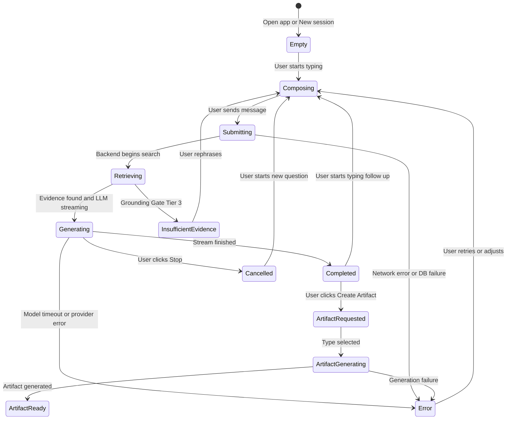

### Artifact States

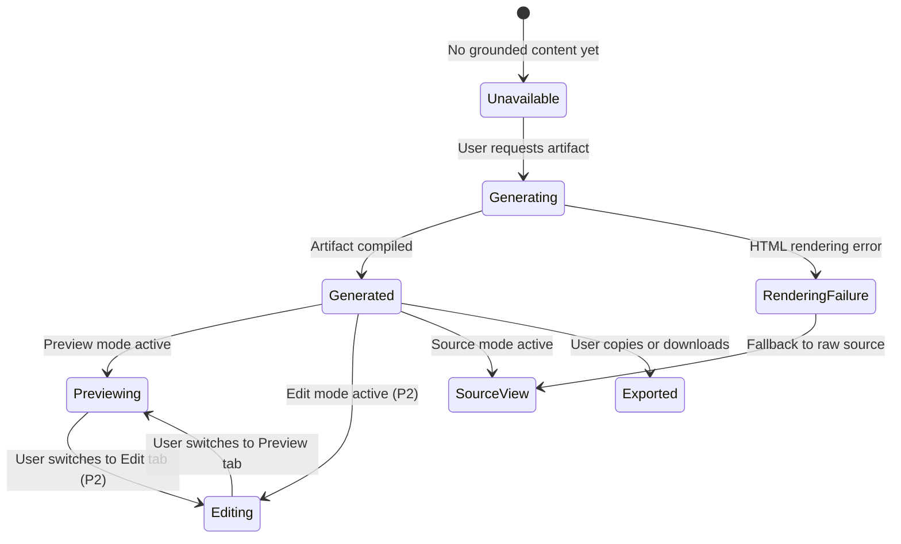

### Source Panel States

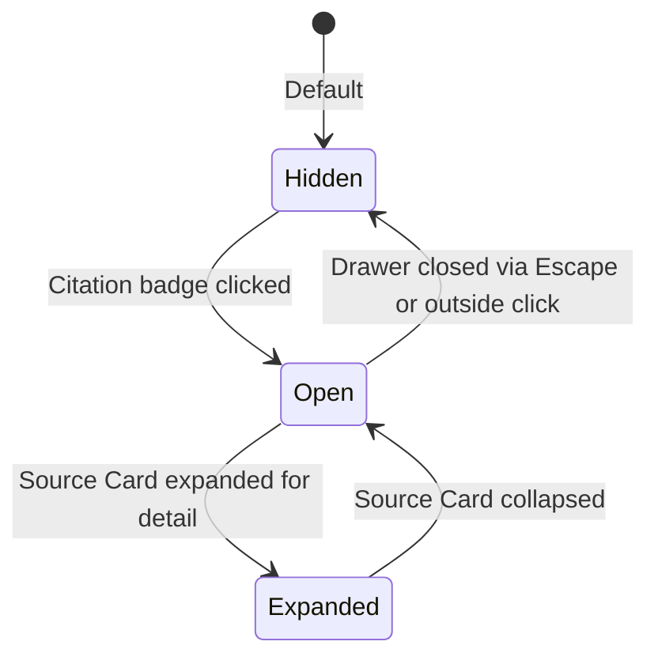

---

## 23. User Flows

### Flow 1: First-Time User / Empty State

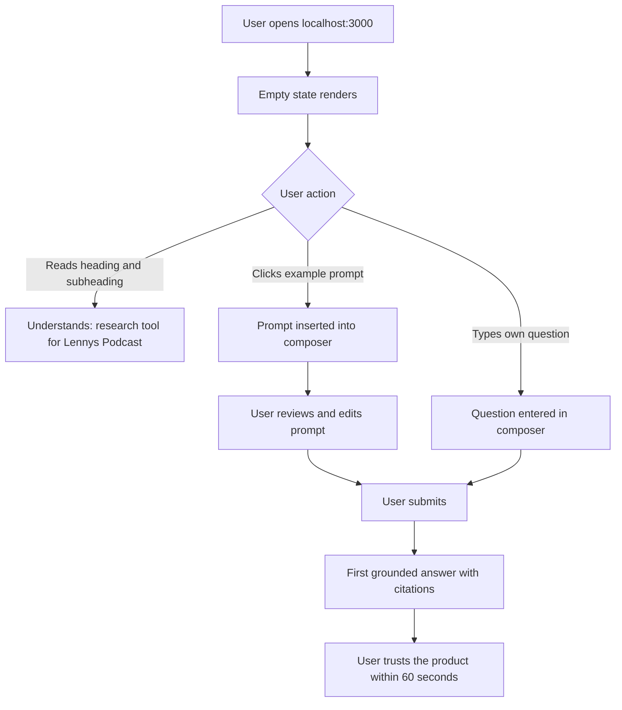

### Flow 2: Ask Grounded Question

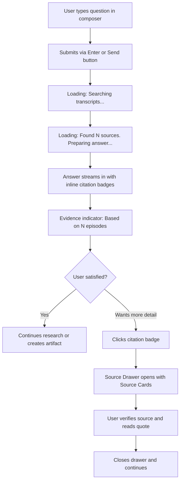

### Flow 3: Follow-Up Question

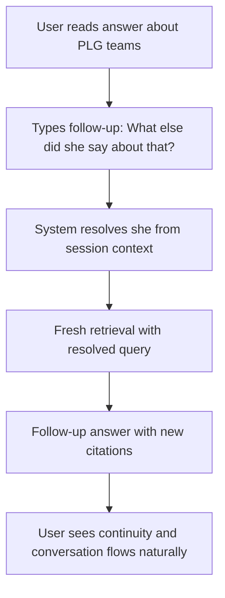

### Flow 4: Inspect Source

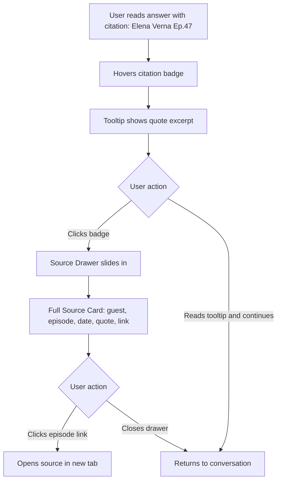

### Flow 5: Insufficient Evidence

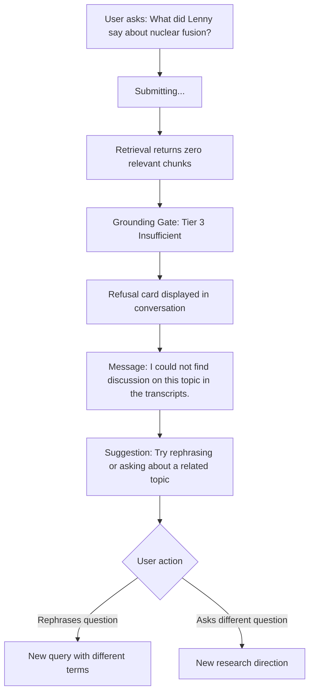

### Flow 6: Generate Artifact

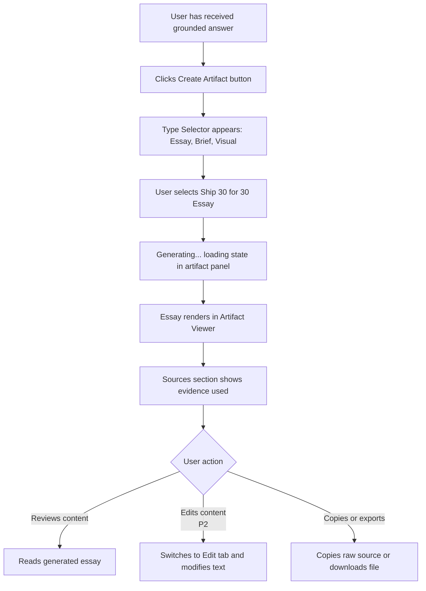

### Flow 7: Edit Artifact *(P2)*

> **Note:** Artifact editing is a P2 capability. The initial release implements Preview and Source tabs only. This flow documents the intended P2 editing experience.

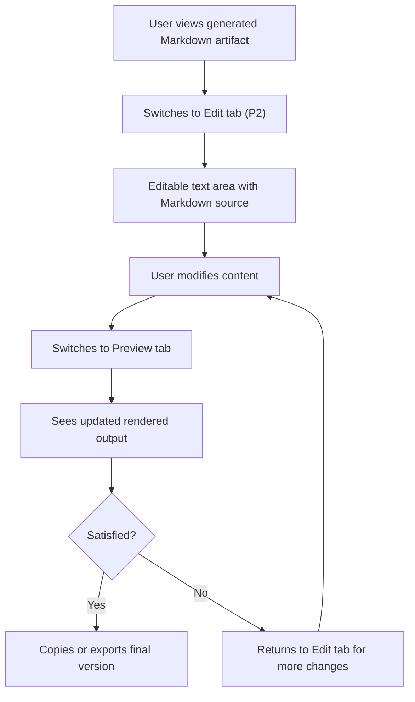

### Flow 8: View HTML Artifact

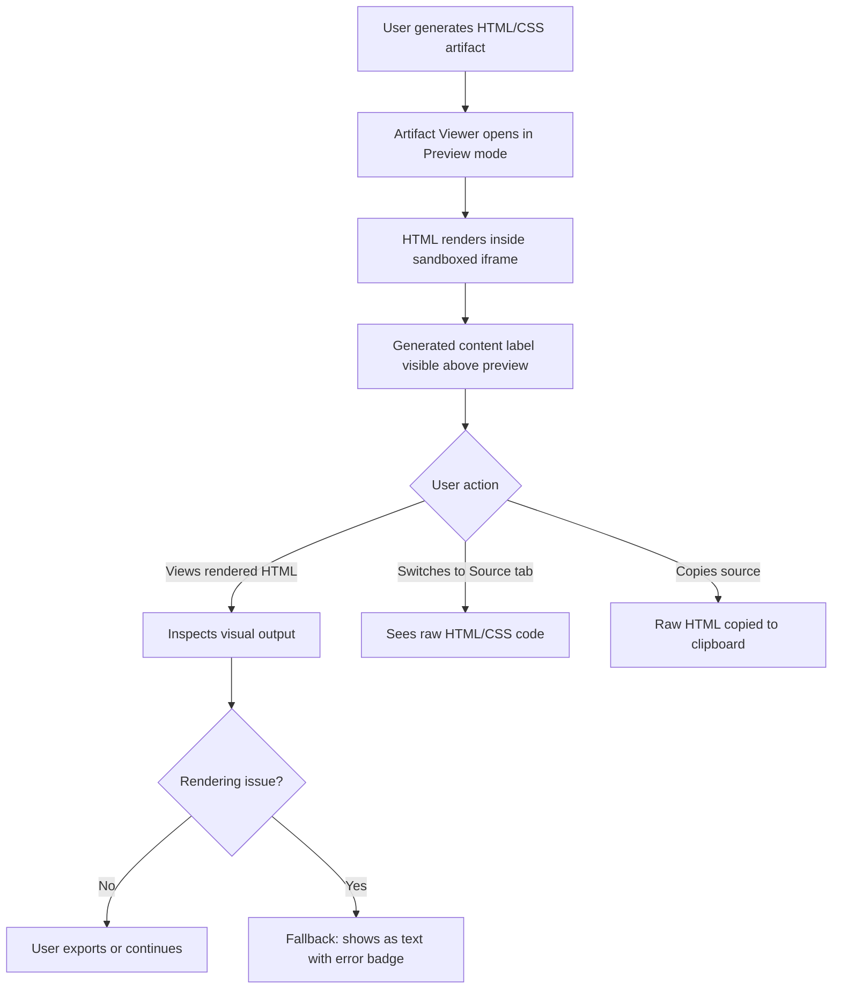

### Flow 9: Provider Failure

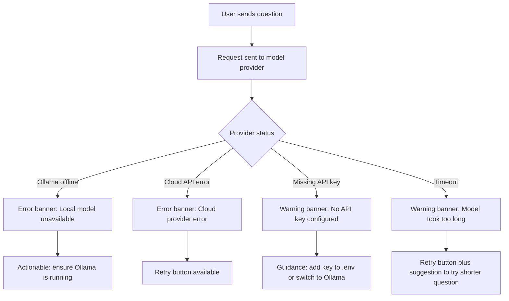

### Flow 10: Session Switching

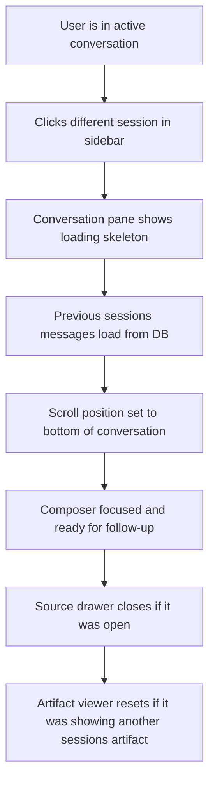

---

## 24. Screen Specifications

### Screen 1: Empty / Landing Conversation

**Purpose:** Orient a new user; communicate what the product does and what questions to ask.
**Primary user goal:** Understand the product's scope and ask a first question.
**Layout:** Full conversation area with centered empty state content. Session sidebar either collapsed or showing a single "New Session" placeholder.
**Key components:** Empty state heading, subheading, corpus indicator, example prompt cards, Composer.
**Primary actions:** Click example prompt, type a question, submit.
**Secondary actions:** Open session sidebar (if collapsed).
**Important states:** No sessions exist (first-ever visit). Sessions exist but a new one was just created.
**Error states:** Database unavailable — banner: "Unable to load sessions. Check database connection."
**Trust considerations:** The empty state must communicate the grounding boundary — "answers come from transcripts" — without technical jargon.

### Screen 2: Active Conversation

**Purpose:** The primary research interface — asking questions and reading grounded answers.
**Primary user goal:** Get a trustworthy, source-attributed answer to a product/growth question.
**Layout:** Session sidebar (left, collapsible), conversation thread (center), source drawer (right, contextual).
**Key components:** Message thread (UserMessage + AssistantMessage), EvidenceIndicator, CitationBadge, LoadingState, Composer, ArtifactAction button.
**Primary actions:** Read answer, click citation to verify source, type follow-up, create artifact.
**Secondary actions:** Switch session, start new session, inspect provider badge.
**Important states:** Streaming (answer appearing word-by-word). Complete (full answer with citations). Refusal (insufficient evidence). Error (system failure). Cancelled (user stopped generation).
**Error states:** Error banner for system failures. Refusal card for knowledge limitations. Timeout message with retry.
**Trust considerations:** Every answer includes evidence quality indicator. Citations are immediately visible, not hidden. Refusals are visually distinct from errors.

### Screen 3: Source Detail / Source Drawer

**Purpose:** Verify the source of a specific claim in an assistant response.
**Primary user goal:** Answer "Why did the assistant say this?" and optionally access the original source.
**Layout:** Right-side drawer overlaying or pushing the conversation content. Contains one or more Source Cards.
**Key components:** SourceDrawer, SourceCard(s), close button.
**Primary actions:** Read quote excerpt, click episode link to open source.
**Secondary actions:** Close drawer, navigate between multiple Source Cards if multiple citations were clicked.
**Important states:** Single source. Multiple sources from one answer. Source link unavailable (no external URL in metadata).
**Error states:** Source data unavailable — shows placeholder: "Source details couldn't be loaded."
**Trust considerations:** Only verified metadata is shown (guest, episode, date, quote from actual retrieved chunk). No generated or inferred metadata.

### Screen 4: Session History

**Purpose:** Navigate between past research sessions.
**Primary user goal:** Find and resume a previous research thread.
**Layout:** Left sidebar with scrollable session list. On mobile, full-screen overlay.
**Key components:** SessionSidebar, SessionItem list, New Session button.
**Primary actions:** Click session to switch. Create new session.
**Secondary actions:** Rename session. Delete session.
**Important states:** Empty (no sessions). Loading (sessions hydrating from DB). Active (one session selected). Many sessions (scrollable list).
**Error states:** Sessions fail to load — show skeleton with retry.
**Trust considerations:** Session isolation — switching sessions must never carry over context or sources from the previous session.

### Screen 5: Artifact Generation

**Purpose:** Transform research insights into a reusable content artifact.
**Primary user goal:** Create a polished piece of content grounded in the conversation's evidence.
**Layout:** Artifact type selector appears as a compact dropdown or card group below the conversation, or within a small popover.
**Key components:** ArtifactAction button (trigger), ArtifactTypeSelector, loading state.
**Primary actions:** Select artifact type, generate.
**Secondary actions:** Cancel generation.
**Important states:** Type selection. Generating (loading). Generated (transition to Artifact Viewer). Error (generation failure).
**Error states:** Generation failure — amber banner in artifact panel with retry option.
**Trust considerations:** The user should understand that the artifact is generated from research evidence, not from independent AI research.

### Screen 6: Artifact Preview / Editor

**Purpose:** Review, export, and *(P2)* edit a generated artifact.
**Primary user goal:** Verify the artifact's quality and accuracy, then use or share it.
**Layout:** Right panel replaces or overlaps the source drawer area. Tabs for Preview / Source / Edit *(P2)*.
**Key components:** ArtifactViewer, tab controls, Copy/Download buttons, Sources section.
**Primary actions (initial release):** Read preview. Switch between rendered and source views. Copy source. Download file.
**Secondary actions *(P2)*:** Edit Markdown content. Live edit/preview workflow.
**Important states:** Previewing (Markdown rendered). Previewing (HTML in iframe). Editing *(P2)* (textarea with live preview). Rendering failure (fallback to text).
**Error states:** HTML rendering error — shows raw source with error badge.
**Trust considerations:** "Generated content" label visible. Sandboxed iframe for HTML. Source attribution section in the artifact.

### Screen 7: Artifact Viewer (HTML)

**Purpose:** Safely render HTML/CSS artifacts generated by the assistant.
**Primary user goal:** See the visual output of a generated HTML artifact.
**Layout:** Same right panel as Screen 6, but the Preview tab renders inside a sandboxed `<iframe>`.
**Key components:** Sandboxed iframe, "Generated content" label, tab controls.
**Primary actions:** Visual inspection of rendered HTML. Switch to Source tab to see code. Copy/download source.
**Secondary actions:** None — viewing is the primary interaction.
**Important states:** Rendering (HTML loads in iframe). Rendered (content visible). Failed (iframe shows blank — fallback to raw source tab).
**Error states:** Rendering failure with "HTML formatting issue — showing as text" badge.
**Trust considerations:** The iframe must NOT be styled to look like it's part of the application. The "Generated content" label and visual boundary must be present. No scripts from the artifact can access the parent application (architecture §12 — `null` origin sandbox).

---

## 25. UX/Product Trade-offs

### Decision 1: Contextual Source Drawer vs. Persistent Source Panel

**Context:** The user needs to verify sources for grounded answers. Two approaches: (A) a persistent right panel always showing sources, or (B) a contextual drawer that appears when a citation is clicked.

**Decision:** Contextual drawer (B).

**Why:** A persistent source panel consumes ~25% of screen width, reducing the conversation reading area — which is the primary use surface. On typical 1440px monitors, this pushes the conversation to a narrow 600px column, making long-form answers harder to read. The contextual drawer preserves reading width while keeping sources exactly one click away.

**Trade-offs:** Users cannot passively see all sources while reading. They must click to inspect.

**Rejected alternative:** Persistent panel — better for power users who constantly verify sources, but worse for the 80% case where the user reads the answer and moves on.

**Consequence:** Source verification requires one explicit click. This is acceptable because the inline citation badges provide a quick visual indicator of which episodes are cited, and the hover tooltip provides the quote excerpt without opening the drawer.

---

### Decision 2: Provider Badge vs. Settings Panel

**Context:** The assignment requires provider visibility (FR-35). Should we expose this as a compact badge or a full settings/configuration panel?

**Decision:** Compact badge in header.

**Why:** For a research tool, "which model am I using?" is important but secondary to "can I trust this answer?" A settings panel would create a feature-wall distraction and imply that provider configuration is a user-facing workflow. It's not — it's an operator configuration (`.env`).

**Trade-offs:** Users cannot switch providers from the UI. This is intentional — provider switching is an operational change, not a research workflow.

**Rejected alternative:** Full settings panel with model selector — positions the product as a "model playground," which it is not.

**Consequence:** The evaluator can verify which model is active. The user is not distracted by infrastructure controls.

---

### Decision 3: Honest Simple Loading vs. Rich Agent Progress

**Context:** The SSE stream emits `thinking`, `evidence`, and `delta` events. Should the UI show a multi-step progress indicator or a simple loading state?

**Decision:** Two-step progress (Searching → Preparing answer) followed by streaming text.

**Why:** Two real stages are reliably detectable: (1) the retrieval phase, and (2) the generation phase. Showing more granular progress (e.g., "Evaluating evidence quality", "Running grounding gate") would imply internal steps the user doesn't need to understand and could create confusion if event timing is inconsistent.

**Trade-offs:** Less impressive than a detailed progress visualization, but more honest. Fake progress steps that don't correspond to actual events would erode trust.

**Rejected alternative:** Detailed multi-step progress with 5+ stages — creates a "wizard" feel that misrepresents the actual system behavior.

**Consequence:** Loading states are always honest. If the SSE events are unreliable, we fall back to a single "Thinking..." indicator without loss of credibility.

---

### Decision 4: Research-First Workflow vs. Podcast Browsing

**Context:** Should the application include podcast episode browsing, guest directories, or topic exploration?

**Decision:** Research-first. No podcast browser.

**Why:** The product is a research assistant, not a podcast catalog. Browsing episodes is a different job (discovery) than asking questions (research). Adding episode browsing would bifurcate the UX and dilute the product's focus. The assignment evaluates product judgment — building unnecessary features is a signal of poor prioritization.

**Trade-offs:** Users who want to browse episodes must use the podcast's website directly. The assistant provides episode links in citation cards for natural discovery.

**Rejected alternative:** Full podcast browser with episode list, guest profiles, and topic tags — doubles the UI surface area without serving the core research job.

**Consequence:** The interface remains focused. Episode discovery happens organically through source citations.

---

### Decision 5: Explicit User-Initiated Artifact Generation vs. Automatic Generation

**Context:** Should the assistant automatically generate artifacts when it detects a "generate an essay" intent, or should artifact creation always be explicitly initiated by the user?

**Decision:** Explicit user initiation via a "Create Artifact" button.

**Why:** Automatic generation violates UX Principle 4 (user control). If the assistant auto-generates a 1,250-word essay every time the user says "that's interesting, could you expand on it," the user loses control over when artifacts are created. Explicit initiation also prevents accidental token consumption on local hardware.

**Trade-offs:** One extra click to initiate artifact creation. The user can also type "turn this into a Ship 30 essay" in the conversation (the agent will handle it via natural language), but the button provides a faster, more discoverable path.

**Rejected alternative:** Auto-detect artifact intent from conversation — creates unpredictable behavior and removes user agency.

**Consequence:** Users always know when an artifact is being generated because they explicitly requested it.

---

### Decision 6: Conversation-First Layout vs. Three-Column Workspace

**Context:** Should the default layout be a three-column workspace (sidebar + conversation + source panel) or a conversation-first layout with contextual panels?

**Decision:** Conversation-first with contextual panels.

**Why:** The primary job is reading answers. A three-column layout on a standard 1440px display gives each column ~400px, which is too narrow for comfortable reading. A conversation-first layout gives the answer ~700-800px, with panels appearing on demand.

**Trade-offs:** The user cannot see conversation and sources simultaneously without opening the drawer, which temporarily compresses the conversation.

**Rejected alternative:** Three equal columns — optimized for comparison but poor for reading.

**Consequence:** The conversation is always comfortably readable. Source inspection is a deliberate, focused action.

---

### Decision 7: Opinionated Artifact Presets vs. Configurable Generation

**Context:** Should artifact generation offer detailed configuration options (word count, tone, target audience, structure) or provide simple type presets?

**Decision:** Opinionated presets with zero configuration.

**Why:** Configuration options create analysis paralysis and slow down the workflow. The Ship 30 for 30 format already encodes specific structural principles (PRD §8.5). Adding user-configurable parameters would undermine the skill's encoded expertise. The research-to-artifact workflow should be fast: select type → generate → review.

**Trade-offs:** Users cannot customize artifact parameters. If the generated output isn't quite right, they can edit it in the viewer.

**Rejected alternative:** Multi-field configuration modal with tone, audience, word count, and style options — turns a transformation into a writing tool configuration exercise.

**Consequence:** Artifact generation is fast and opinionated. Users edit afterward rather than configuring beforehand.

---

### Decision 8: Dense Source Metadata vs. Cognitive Simplicity

**Context:** How much source metadata should be visible in citation badges and Source Cards? Options range from minimal (guest name only) to dense (guest, episode, date, score, chunk position, full quote).

**Decision:** Progressive density. Badges show guest + episode number. Source Cards show full detail. Similarity scores are hidden.

**Why:** Inline citation badges must be scannable — they compete for visual attention with the answer text. Overloading them with metadata makes answers unreadable. The Source Drawer provides full context for users who want depth. Internal scores (similarity, chunk index) are engineering artifacts, not user-facing research data.

**Trade-offs:** Power users cannot see similarity scores without browser devtools. This is acceptable because scores are implementation details, not research data.

**Rejected alternative:** Dense inline citations with guest, date, and score — makes every answer look like an academic paper.

**Consequence:** Answers are readable. Source depth is available on demand.

---

### Decision 9: Auto-Generated Session Titles vs. Manual Naming

**Context:** Should session titles be auto-generated from the first message, manually entered, or use AI-generated summaries?

**Decision:** Auto-generated from the first user message, truncated to ~40 characters. User-editable.

**Why:** Users rarely proactively name research sessions. Requiring a title upfront adds friction to starting a new session. Auto-generating from the first message provides "good enough" recognition for finding past sessions. Users who want better names can edit.

**Trade-offs:** Auto-generated titles from questions can be awkward ("What do the best growth teams look li..."). But they are still more useful than "Untitled Session 7."

**Rejected alternative:** AI-generated summaries — adds latency and complexity for marginal improvement over truncated first message. Manual naming — adds friction to the most common action (starting a new session).

**Consequence:** Session creation is zero-friction. Titles are functional if imperfect. Editing is available.

---

### Decision 10: Evidence-First Progressive Disclosure vs. Immediate Full Answer

**Context:** Should the UI show retrieved evidence first (before the synthesis) to build trust, or show the synthesized answer immediately with evidence available on inspection?

**Decision:** Immediate answer with inline evidence indicators. No evidence-first gate.

**Why:** Showing raw evidence before the synthesis would require the user to read and evaluate transcript chunks themselves — which is exactly the labor the product eliminates. The value proposition is synthesis, not evidence browsing. Evidence indicators (badges, drawer) provide verification without forcing the user to do the retrieval work manually.

**Trade-offs:** Users trust the synthesis first and verify second. If the synthesis misrepresents the evidence, the user must click through to discover the discrepancy.

**Rejected alternative:** Evidence-first view showing retrieved chunks before synthesis — turns the product into a search engine instead of a research assistant.

**Consequence:** The user experience prioritizes synthesis. Verification is available but not mandatory.

---

## 26. UX Assumptions and Validation

| # | Assumption | Why It Matters | How to Validate |
|---|-----------|----------------|-----------------|
| A1 | Users value evidence verification — they want to know where an answer came from, not just what it says. | If false, citation design is over-invested and could be simplified to a footnote. | Post-launch: track citation click-through rate. If < 5% of users ever click a citation, reconsider the visual investment. |
| A2 | Users are primarily researching product/growth questions, not browsing the podcast catalog. | If false, a podcast browser might be more valuable than a Q&A interface. | User interviews before production launch. |
| A3 | Users prefer a fast path to answers over extensive configuration. | If false, our opinionated presets may frustrate power users who want fine-grained control. | Observe whether users attempt to modify generation parameters or express frustration with preset outputs. |
| A4 | Desktop is the primary environment. | If false, mobile-first design would be needed, changing the layout fundamentally. | Usage analytics: screen-width distribution. |
| A5 | The corpus is sufficiently large (~300 episodes) that source exploration (drawer, cards) is valuable. | If the corpus were tiny (5 episodes), a source drawer would be overkill. At ~300 episodes, it's warranted. | Review corpus size at launch. |
| A6 | Artifact creation is secondary to research but important enough to deserve first-class workflow support. | If artifacts are never used, the viewer is wasted engineering effort. If they're used constantly, they might need a dedicated workspace. | Track artifact generation frequency relative to conversation turns. |
| A7 | "I don't know" is more valuable than a plausible-sounding guess for this product's users. | If users prefer brainstorming-style responses, the strict grounding boundary may frustrate them. | Qualitative user feedback during evaluation. |
| A8 | Follow-up questions are a natural part of the research workflow, not an edge case. | If users primarily ask standalone questions, multi-turn context management is lower priority. | Track average session length (messages per session). |
| A9 | Users trust inline citation badges as sufficient evidence markers and will click through only when they need deeper verification. | If users distrust badge-level citations and always need full quotes, the source drawer should be persistent rather than contextual. | Citation click-through rate and user feedback. |

---

## 27. Design Non-Goals

The following are explicitly excluded from the design scope:

| Non-Goal | Reason |
|----------|--------|
| **Generic AI chat customization** (system prompts, temperature sliders, persona selection) | This is a focused research tool, not a model playground. |
| **Model playground / prompt engineering UI** | Provider configuration is an operator concern, not a user workflow. |
| **Podcast streaming / audio playback** | We link to episodes; we don't play them. This is a research assistant, not a media player. |
| **Social features** (sharing, commenting, collaboration) | Out of scope per PRD. The product is for individual research. |
| **Full knowledge-management platform** (folders, tags, collections, notebooks) | Session history is sufficient for a take-home scope. |
| **Autonomous publishing** (auto-post to blog, auto-send to Slack) | Violates user-control principle. The user exports manually. |
| **Arbitrary web research UI** (internet search, URL scraping) | Violates the corpus-boundary principle. |
| **Complex analytics dashboard** (usage metrics, retrieval statistics, token costs) | Premature for a take-home. No production traffic to analyze. |
| **Dark mode** | Desirable for polish but not critical for the take-home. Light mode prioritized for readability. Can be added as P2 enhancement. |

---

## 28. Evaluator Demo Journey

The product should be demonstrable in under 3 minutes without external instructions.

### Recommended Demo Script

| Step | Evaluator Action | What They See | What It Proves |
|------|-----------------|---------------|----------------|
| 1 | Opens `localhost:3000` | Empty state with product identity, corpus description, and example prompts | Product clarity — evaluator understands what this is within 10 seconds |
| 2 | Clicks example prompt: "What have Lenny's guests said about product-led growth?" | Prompt appears in composer | Discoverable interaction |
| 3 | Clicks Send | "Searching transcripts..." → "Found 4 sources..." → answer streams in | Real retrieval + real generation |
| 4 | Reads answer | Structured synthesis with inline citation badges `[Elena Verna, Ep. 47]` `[Casey Winters, Ep. 89]` | Grounded answers with attribution |
| 5 | Clicks a citation badge | Source Drawer opens with guest, episode, date, quote excerpt | Source verification works |
| 6 | Types follow-up: "How does that compare to enterprise-led approaches?" | Grounded comparison answer with new citations | Multi-turn context works |
| 7 | Clicks "Create Artifact" → selects "Essay (Ship 30 for 30)" | Artifact Viewer opens, essay generates with hook/progression/takeaways | Artifact workflow connected to research |
| 8 | Views generated essay | ~1,250-word essay with source attribution section | Writing skill with encoded principles |
| 9 | Checks provider badge in header | Shows `🟢 Ollama (llama3.1:8b)` | Local-first demo confirmed |
| 10 | Asks out-of-corpus question: "What's the best recipe for pasta?" | Refusal card: "I couldn't find enough support in the transcripts..." | Grounding boundary holds |

**Total time:** ~3 minutes. No configuration. No explanation needed.

---

## 29. PRD + Architecture Traceability

| PRD Requirement | Architecture Capability | UX Mechanism | User-Visible Behavior | Validation |
|----------------|------------------------|--------------|----------------------|------------|
| **FR-1, FR-2:** Grounded Q&A | HNSW search + Grounding Gate | Conversation with inline citations + evidence indicator | User asks question → gets answer with episode/guest citations | Manual test: 10 known-answer queries |
| **FR-3:** Follow-up questions | Session Manager hydrates N=6 turns, query rewriting | Continuous conversation thread, no context restatement needed | "What else did she say?" resolves correctly | Multi-turn follow-up test |
| **FR-4:** Source citations | `source_references` table + XML evidence injection | Inline CitationBadges + Source Drawer with Source Cards | User clicks badge → sees guest, episode, quote, link | Click every citation in 5 test answers |
| **FR-5:** Unsupported question refusal | Grounding Gate Tier 3 | Distinct refusal card (not an error banner) | "I couldn't find enough evidence..." | 10 out-of-corpus test queries |
| **FR-6:** Ambiguous question handling | Agent system prompt | Clarification message in conversation thread | "Could you clarify whether you're asking about X or Y?" | Submit 3 ambiguous queries |
| **FR-12–15:** Session persistence | PostgreSQL sessions + messages tables | Session sidebar, session switching, history loading | Sessions survive server restart | Restart Docker → verify sessions load |
| **FR-17–18:** Provider switching | `LLM_PROVIDER` env variable + adapter pattern | Provider badge reflects active provider | Badge shows "Ollama" or "Anthropic" based on config | Toggle env var → verify badge change |
| **FR-19:** Provider visibility | Architecture §6.1 status badge | ProviderBadge in header | Evaluator sees which model is running | Visual inspection |
| **FR-20:** Fallback behavior | No silent fallback (architecture §9.3) | Error banner when provider fails, not silent degradation | "Cloud provider returned an error. Please try again." | Disconnect Ollama → verify error |
| **FR-21–23:** Ship 30 for 30 skill | `ship30_writer` Pi extension, ~1,250 words | ArtifactTypeSelector → "Essay (Ship 30 for 30)" | 1,250-word essay with hook, progression, takeaway, citations | Generate 3 essays → review structure |
| **FR-24–26:** Artifact generation | `artifact_compiler` Pi extension | ArtifactAction button → type selector → generation | Markdown or HTML artifact appears in viewer with source attribution | Generate 5 artifacts across types |
| **FR-28–30:** Artifact Viewer | Sandboxed iframe + Markdown renderer | Artifact Viewer with Preview/Source tabs (Edit tab is P2) | Rendered content visible alongside chat | Visual inspection of all artifact types |
| **FR-31:** Split-pane layout | Architecture §6.1 | Conversation + contextual right panel | Chat left, artifacts/sources right (on demand) | Desktop layout inspection |
| **FR-32:** Chat interface | SSE streaming + conversation state | Streaming text + loading states + user/assistant distinction | Progressive answer rendering | Time-to-first-token test |
| **FR-33:** Responsive layout | N/A (frontend concern) | Breakpoint-driven layout adaptation | Sidebar collapses, panels become overlays | Resize browser to test breakpoints |
| **FR-34:** Interaction states | Architecture §17.1 failure matrix | Idle/Processing/Error/Artifact states | Clear visual feedback for each state | Trigger each state manually |
| **FR-35:** Provider visibility | Architecture §6.1 | ProviderBadge | Evaluator sees model name | Visual inspection |
| **FR-36–38:** HTML sandbox | Bare `sandbox` iframe (no `allow-scripts`), CSP, sanitization | Sandboxed iframe with "Generated content" label | No JS execution, parent app protected | Inject `<script>` → verify no execution |
| **FR-41:** Secret management | `.env.example` with safe defaults | No API key entry in UI. Provider badge shows config state | User never enters credentials in the app | Inspect UI for absence of key fields |
| **Responsive (PRD §11)** | N/A | Breakpoint system (§17) | Usable on desktop and tablet | Resize browser |
| **Docker Compose** | `docker-compose.yml` with services | Empty state and error states work on fresh boot | System starts without cloud keys | `docker compose up` from fresh clone |
| **Observability (PRD §13)** | Structured JSON logs | N/A (not user-visible UX) | Logs visible via `docker compose logs` | Check structured log output |

---

## 30. Design Risks

| Risk | Severity | Mitigation |
|------|----------|------------|
| **Citation badges add visual noise to answers** | Medium | Keep badges small, muted-color pills. Limit to max 3-4 unique badges per answer paragraph. If answers become cluttered, consolidate into a "Sources (N)" badge at the end of each paragraph. |
| **Source Drawer compresses conversation on narrow screens** | Medium | On screens < 1024px, Source Drawer opens as full-screen overlay instead of side panel. On larger screens, drawer width is capped at 360px. |
| **Users mistake refusal for error** | Medium | Distinct visual treatment: refusal uses a warm cream card in the conversation flow; errors use a red/amber banner above the conversation. Different iconography (info icon vs alert icon). |
| **Empty state fails to set expectations** | Medium | User-test the empty state copy with 3 people before finalizing. If the grounding boundary isn't understood, add a one-sentence explanation. |
| **Artifact Viewer complexity delays core research UX** | Low | Artifact Viewer is P1, implemented after the core conversation loop (Phase 6 in PRD). If time is tight, a basic Markdown renderer ships first; HTML viewer follows. |
| **Provider badge confuses non-technical users** | Low | Badge uses plain language ("Ollama" not "llama3.1:8b-q4_0"). Model version shown only in tooltip on hover. |
| **Streaming text animation causes motion discomfort** | Low | Respect `prefers-reduced-motion`. When enabled, show complete paragraphs instead of word-by-word streaming. |
| **Artifact editing breaks source attribution** | Low | When user edits artifact content, a subtle notice appears: "Editing may affect source attribution." The original sources section remains in the artifact but is marked as "based on original generation." |

---

## 31. Definition of Design Done

The design is complete and ready for engineering implementation when:

1. **Every P0 and P1 PRD requirement** has a corresponding UX mechanism documented in this specification.
2. **Every architecture constraint** (grounding gate tiers, security sandbox, session isolation, provider model, failure modes) is reflected in the interface design.
3. **Grounding is visible** — citations are first-class UI, evidence quality is communicated, and refusals are honest and distinct from errors.
4. **Source traceability is first-class** — the user can go from any claim to its episode source with one click.
5. **Unsupported questions** have a dedicated, non-error UX treatment.
6. **Artifact generation** is connected to the research workflow, not positioned as an independent writing tool.
7. **HTML security boundaries** are visually preserved without frightening users.
8. **Ollama remains the normal local demo path** — no cloud dependency required, no confusing credential prompts.
9. **Cloud provider support** exists without complicating the primary UX (badge-only visibility).
10. **The interface is focused** — no feature walls, dashboards, or unnecessary controls competing with the research workflow.
11. **Product trade-offs are documented** with context, rationale, and rejected alternatives.
12. **A frontend engineer** can implement the interface from this document without inventing the major interaction states, component hierarchy, or user flows.
13. **The evaluator demo journey** is achievable in under 3 minutes without external instructions.

---

*This design document translates the product contract (PRD.md) and technical architecture (architecture.md) into an implementation-ready interaction design. Engineering decisions at the component level should reference this document. Significant deviations require updating the design with rationale.*
